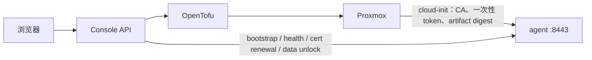
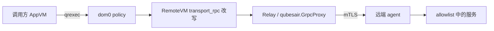

# 架构与信任边界

## 目标

Qubes Air 让本地 Qubes AppVM 通过熟悉的 qrexec 接口使用远端普通 Linux VM，同时保留
本地 dom0 的 policy 决策，并把基础设施凭据、传输身份和远端工作负载分开。

当前已验证 provider 为 Proxmox。GCP 和 AWS 仍不完整。

## 组件

| 组件 | 职责 | 不应持有 |
|---|---|---|
| dom0 | RemoteVM 元数据、qrexec policy、调用改写 | 云凭据、CA 私钥、远端数据密钥 |
| console AppVM | Web/API、OpenTofu 编排、PKI、健康探测、证书续期 | Relay/agent 私钥 |
| vault | 存放人工管理的云凭据和 state passphrase；无网络 | 工作负载数据 |
| Relay AppVM | 接收 RemoteVM 改写调用，经 mTLS 连接 agent | 云 API 凭据、console CA 私钥 |
| RemoteVM | dom0 中的远端身份记录；不可启动 | 任何运行时数据 |
| remote agent | 执行允许的服务，承载文件/TCP 流 | 云凭据、console CA 私钥 |
| Proxmox | 提供计算、持久盘和 cloud-init | LUKS 明文密钥、agent 私钥 |

Qubes 侧部署由独立的
[qubes-salt-config](https://github.com/slchris/qubes-salt-config) 管理。本仓库负责应用、
transport、agent、Terraform/OpenTofu 和打包。

## 两条路径

### 控制面

控制台创建 Qube 后：

1. 生成短期单次 bootstrap token；
2. 把公开 CA、token、agent 包 URL/SHA256 写进 cloud-init；
3. agent 在 guest 内生成私钥和 CSR；
4. 控制台主动连接 agent，消费 token 并签发证书；
5. 后续连接使用 mTLS，token 不再参与；
6. 控制台触发受限 qrexec 服务，在 dom0 注册 RemoteVM；
7. Relay 定时从控制台拉取 `remote-name -> ip:port` 端点。

### 数据面

控制台只参与端点发布和证书签发，不在每次调用的数据面。Relay 使用自己生成、由控制台 CA
签发的客户端证书；私钥不离开 Relay。

## RemoteVM 语义

RemoteVM 不是一台本地 VM，而是一条包含 `relayvm`、`transport_rpc` 和 `remote_name` 的
元数据记录。对它的 qrexec 请求由 dom0 改写为发给 Relay 的 transport 调用。

因此：

- 不要对 RemoteVM 执行 `qvm-start`、`qvm-shutdown` 或 `qvm-kill`；
- start/stop 按钮操作的是云端计算实例，不是 dom0 的 RemoteVM 对象；
- 允许哪些 caller、target 和 service，由本地 dom0 policy 决定；
- 远端不是另一个 Qubes 系统，没有第二个 dom0 policy。

## 远端服务

| 服务 | 用途 | 默认风险处理 |
|---|---|---|
| `qubesair.Ping` | 连通性与身份检查 | 可按 tag 放行 |
| `qubesair.Exec` | 以宿主 root 执行命令 | dom0 默认 `ask`；Debian agent 包当前默认启用 |
| `qubesair.FileCopy` | 以宿主 root push/pull 任意绝对路径 | dom0 默认 `ask`；Debian agent 包当前默认启用 |
| `qubesair.ConnectTCP` | 在 mTLS 通道内流式转发 TCP | 只允许显式目标/端口 |
| `qubes.GetAppmenus` | 枚举远端桌面应用 | 无私密参数 |
| `qubes.StartApp` | 在 Xpra display 启动应用 | app id 严格校验 |
| `qubesair.UnlockData` | 解锁/初始化 LUKS 数据盘 | 密钥由控制台派生并通过 mTLS 使用 |

## 存算分离与加密

Proxmox provider 把短生命周期计算 VM 和持久数据盘分开：

- suspend 销毁计算资源、保留数据盘；
- resume 从模板重建计算 VM 并挂回同一数据盘；
- 数据盘可使用 LUKS，默认策略可由 `QUBES_AIR_ENCRYPT_DATA_DEFAULT` 控制；
- agent 身份跟内容/实例绑定，resume 时由现行 bootstrap/续期流程恢复，不复制私钥。

OpenTofu state 可在客户端加密后写入 S3 兼容或 PostgreSQL backend，见
[terraform-state.md](terraform-state.md)。

## 安全边界

1. **本地 dom0 应当是授权根。** 正常 RemoteVM 调用必须经过 dom0 policy；但当前 agent 只校验
   fleet CA、未校验调用方角色，持有同一 CA 证书的内部节点仍可能直接连接 agent。这是必须优先
   修复的信任边界缺口，见[路线图](roadmap-to-production.md)。
2. **远端和云平台不可信。** 敏感数据必须在上传前加密；销毁依赖丢弃本地密钥，而不是覆写
   云盘。
3. **console 是高价值控制面。** 它持有 CA 和基础设施权限，应是专用 AppVM，API 必须认证、
   CORS 必须收敛。
4. **Relay 是受限数据面。** 它能发起已授权远端调用，但不应获得云凭据或 CA 签发权。
5. **反向调用默认不可信。** 如果启用远端到本地的调用，最终必须再次经过 dom0 `ask`。
