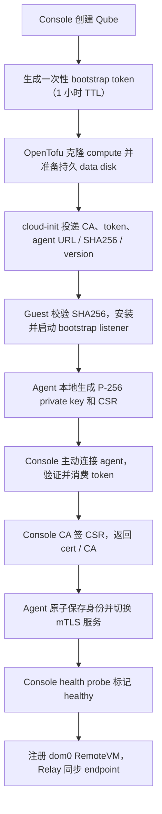

# Bootstrap、身份与存储设计

本文记录当前约束和已经实现的决定。

## 1. 目标

从一个 Proxmox cloud-init 模板创建远端 Qube，自动得到可用 agent，同时满足：

- agent 私钥不进入镜像、cloud-init、console 或网络；
- 置备失败能重试，单次 token 不能重放；
- agent 版本由 console 钉住，可独立于 VM 模板升级；
- suspend/resume 保留数据盘，但不靠复制旧系统盘维持身份；
- 云平台和远端宿主机只接触密文数据盘。

## 2. 已验证流程



Proxmox 真机已经跑通这条闭环。

## 3. 为什么由 console 主动连接

当前 Proxmox 网络允许 console 访问 guest 的 agent 地址。采用 console 主动拨号有三个好处：

- agent 不需要持有 console API 凭据；
- token 只作为首次连接的短期证明，不会变成长驻 secret；
- 健康探测、证书续期和数据盘解锁可以复用同一方向。

这不是所有 provider 的通用结论。GCP 私网目前不一定对 console 可达，必须先解决可信网络
路径，不能通过向 cloud-init 塞长期私钥绕过。

## 4. Proxmox 置备边界

Console 通过 Terraform/OpenTofu 管理 VM。cloud-init snippet 需要出现在目标节点可见的 snippet
storage；当前流程支持按内容哈希命名并上传，避免多个 Qube 共用可变路径。

节点 SSH 是基础设施安装/投递手段，不是每次 guest bootstrap 的身份通道。生产环境应把权限
限制到所需节点和目录，并优先使用集群原生、可审计的 artifact/snippet 分发。

## 5. 镜像内容

模板只应包含稳定的系统依赖和最小启动条件，不包含：

- agent 私钥或长期证书；
- console CA 私钥；
- 云 provider 凭据；
- 每个 Qube 的 LUKS 密钥；
- 固定版本的业务 agent。

Agent 不烤进 VM 模板，发布使用独立 Debian 包和 digest pinning。

## 6. Agent artifact

Agent 从局域网 artifact store 下载，console 配置同时钉住 URL、版本和 SHA256：

```bash
make release-agent VERSION=<version>
```

artifact store 可以是明文 HTTP，但完整性完全依赖 SHA256 配置来自可信通道。URL 与 digest 必须
一起更新；只换 URL 或只换文件都会 fail closed。

## 7. 身份按内容与实例绑定

身份文档和 cloud-init snippet 使用内容哈希命名，不覆盖共享固定路径。这样 Terraform plan、
Proxmox 缓存和旧 VM 不会悄悄引用被替换的身份材料。

Agent 私钥只在 guest 创建。Console 保存 CA 和签发记录，不保存 agent 私钥。Relay 采用相同的
CSR 原则：私钥在 Relay 创建，通过本地 qrexec 送 CSR 给 console 签发。

## 8. 证书续期与 resume

Agent 在当前 mTLS 身份仍有效时提交 CSR 续期；console scheduler 在阈值内触发续期。旧证书
自然过期，不把“立即吊销”伪装成已经存在的 CRL。

Resume 会重建 compute VM 并挂回持久数据盘。新的系统实例重新经过 bootstrap/身份恢复流程，
而不是从 data disk 读取可复制的长期传输私钥。

## 9. Bootstrap token

Token 具备以下属性：

- 每个 Qube 独立；
- 数据库只保存可校验表示，不保存可直接重放的明文；
- 有明确过期时间，当前默认设计为 1 小时以覆盖较慢的 apt/首次启动；
- 验证与消费在同一原子操作中完成；
- resume 或重建需要时重新签发，而不是复用旧 token；
- 只允许换取被身份规则钉住的 agent 证书。

## 10. Provider 差异

| Provider | 资源 | Bootstrap 可达性 | 状态 |
|---|---|---|---|
| Proxmox | compute/storage 分离 | console 可主动拨 guest | 已真机验证 |
| GCP | 资源已有实现 | 私网地址对 console 的可信路径未闭环 | 未完成 |
| AWS | 接口骨架 | 未设计完成 | 未完成 |

Provider 适配必须同时回答“如何投递公开 bootstrap 材料”和“console 如何可信地连接 agent”。

## 11. 网络

Relay 经 mTLS 连接 agent；GUI/TCP 复用同一安全通道。

如果未来某 provider 需要 overlay network，它应按 Zone 提供，并保持与 qrexec policy、凭据
存储和 agent 身份分离。

## 12. 密钥归属

| 密钥 | 生成位置 | 保存位置 | 轮换者 |
|---|---|---|---|
| console CA | console | console 加密存储 | 运维/恢复流程 |
| agent private key | remote guest | guest identity dir | agent CSR 续期 |
| Relay private key | Relay | Relay `/rw` 持久目录 | relay bootstrap/timer |
| data LUKS material | console 派生/控制 | 不写远端持久明文 | console |
| OpenTofu state passphrase | vault | vault | 人工受控流程 |

## 13. 剩余工作

- GCP/AWS 的可信可达性与真实验收；
- CA 灾难恢复、吊销和大规模证书运维；
- artifact store 的认证/签名与发布审计；
- 清理失效的源码文档引用。
