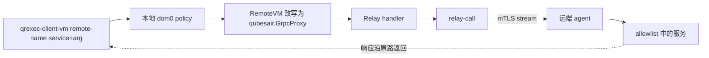

# RemoteVM gRPC transport

## 状态

2026-07 已在真实 Qubes R4.3 + Proxmox 环境验证：

- dom0 把 RemoteVM qrexec 请求改写到独立 Relay；
- Relay 用本地生成、console CA 签发的证书连接远端 agent；
- endpoint 自动同步，新建 Qube 无需手写 QubesDB；
- `Ping`、`Exec`、`FileCopy` 与 `ConnectTCP` 均端到端通过；
- GUI/TCP 流量复用 agent mTLS，不暴露额外 LAN 应用端口；
- agent、Relay 证书支持续期，连接支持保活和重连。

## 数据流



远端是普通 Linux VM，没有 dom0、vchan 或第二次 qrexec policy。正常 RemoteVM 路径由本地
dom0 授权，agent allowlist 是纵深防御；当前 fleet 证书角色未隔离，存在绕开正常路径直接连接
agent 的缺口，见下文“证书验证”。

## 组件

| 位置 | 实现 | 职责 |
|---|---|---|
| dom0 | RemoteVM + policy | caller/target/service 授权与 transport 改写 |
| Relay | `qubesair.GrpcProxy` | 解析改写参数和 endpoint，调用 `relay-call` |
| Relay | `relay-bootstrap` | 本地生成私钥/CSR，经 qrexec 获取签名证书 |
| Console | `issue-relay-cert` | 按 qrexec caller 身份钉住 Relay CN 并签 CSR |
| Console | `list-endpoints` | 只读发布远端 name 到 `ip:port` 的映射 |
| Agent | `qubes-air-agent` | mTLS endpoint、service allowlist、执行与 streaming |
| Go transport | `internal/transport/grpc` | 帧、多路复用、保活、重连与双向流 |

Qubes 上的部署 state 位于
[qubes-salt-config](https://github.com/slchris/qubes-salt-config) 的 RemoteVM/gRPC 相关目录。

## Relay 身份

Relay 不持有 console CA。首次启动或续期时：

1. `relay-bootstrap` 在 Relay 生成 P-256 private key 和 CSR；
2. CSR 通过本地 qrexec 调用 `qubesair.IssueRelayCert`；
3. dom0 policy 只允许指定 Relay 调用指定 console；
4. console 从 `$QREXEC_REMOTE_DOMAIN` 得到不可由 Relay伪造的 caller 身份；
5. 证书 CN 被固定为对应 Relay，私钥始终留在 Relay；
6. cert/key/CA 原子写入 Relay 的 `/rw` 持久目录并由 timer 续期。

不要恢复 split-SSH 私钥或把 Relay 私钥存进 vault。

## Endpoint 同步

Console 的 `qubesair.RemoteEndpoints` 只返回名称和 `ip:port`，不返回凭据。Relay 在启动时及
定时拉取，将结果写入自身 QubesDB `/remote-endpoint/<name>`。`GrpcProxy` 每次调用从这里解析
目标。

这使 console 不进入数据面，同时允许新建 Qube 在同步周期内自动可用。

## 服务契约

### Ping

无敏感输入，返回远端名称和时间。用于连通性、mTLS 身份和完整数据路径验收。

### Exec

stdin 是命令文本，响应合并 stdout/stderr。远端执行由 `systemd-run` 进入独立 scope，避免
继承 agent unit 的过严沙箱。真实命令退出码通过响应 trailer 表示，transport 本身保持可返回
输出。

### FileCopy

stdin 第一行为 `push <absolute-path>` 或 `pull <absolute-path>`。Push 使用临时文件加原子
rename；响应包含字节数和 SHA256。它只适合配置和脚本，不替代大文件同步工具。当前 16 MiB
检查发生在输出已经进入内存之后，还不是可靠的资源上限，修复项见[路线图](roadmap-to-production.md)。

### ConnectTCP

建立原始双向 byte stream，供 Xpra/VNC/RDP 等协议使用。端口不直接暴露给 LAN，数据仍经过
agent mTLS。调用端必须经 dom0 policy，Relay/agent 还应限制允许的 target 和 port。

### Appmenus / StartApp

`qubes.GetAppmenus` 枚举 `.desktop` 应用，`qubes.StartApp+<app-id>` 在远端 Xpra display
启动应用。传输对带 `+arg` 的服务保留参数；完整菜单/桌面体验仍在收尾。

## 证书验证

Agent 和 Relay 证书都链到 console CA。某些连接按裸 IP 发起，证书没有稳定 IP SAN，因此
实现使用自定义 `VerifyConnection` 对固定 CA 池做完整链验证，而不是无条件跳过 TLS 校验。

当前验证仍有一个关键缺口：同一 CA 下没有强制区分 agent、Relay 和 Console 调用方角色，
`relay-call` 也没有把远端 endpoint 绑定到预期 agent 名称。修复前，CA 链验证不能等同于完整
授权；具体改造顺序见[路线图](roadmap-to-production.md)。

Console CA 是高价值根。Relay/agent 只能提交 CSR，不能获得 CA 私钥或任意签发能力。

## Policy 原则

- `Ping` 可对受控 caller 和 `@tag:remote-zone` 放行；
- `Exec`、`FileCopy` 和 GUI/端口转发默认 `ask` 或更窄；
- Relay 不得直接调用 dom0 admin API；
- RemoteVM tag 用于覆盖新对象，不能使用不受支持的服务名 glob；
- 反向调用如果启用，最终目标固定，并必须再次经过 dom0 `ask`。

最终 policy 以 qubes-salt-config 部署到 dom0 的文件为准。

## 验收

```bash
qvm-prefs <remotevm> transport_rpc   # qubesair.GrpcProxy
qvm-prefs <remotevm> relayvm

qrexec-client-vm <remotevm> qubesair.Ping
printf 'uname -a; id\n' | qrexec-client-vm <remotevm> qubesair.Exec
```

更完整的逐层检查见[RemoteVM 自检](remotevm-selfcheck.md)。

## 剩余工作

- 无缝桌面完整验收与恢复体验；
- 更严格的 ConnectTCP 目标/端口策略；
- 多 provider/NAT 场景的真机矩阵；
- CA 灾难恢复、吊销和审计；
- 删除未使用的 transport 实现与陈旧源码注释。
