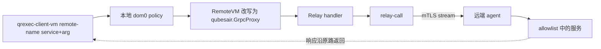

# RemoteVM gRPC transport

## 状态

已有 RemoteVM、独立 Relay、mTLS 与远端服务的真机记录，见
[历史验收汇总](reviews/validation-history.md)。本页描述当前协议，不把历史通过视为当前
全部改动的回归结果；角色与吊销执行见下文。

## 数据流


```mermaid
flowchart LR
  Caller["qrexec-client-vm remote-name service+arg"] --> Policy["本地 dom0 policy"]
  Policy --> Rewrite["RemoteVM 改写为 qubesair.GrpcProxy"]
  Rewrite --> Handler["Relay handler"]
  Handler --> RelayCall["relay-call"]
  RelayCall -->|"mTLS stream"| Agent["远端 agent"]
  Agent --> Service["allowlist 中的服务"]
  Service -.->|"响应沿原路返回"| Caller
```

远端是普通 Linux VM，没有 dom0、vchan 或第二次 qrexec policy。正常 RemoteVM 路径由本地
dom0 授权，agent allowlist 是纵深防御；当前 fleet 证书角色未隔离，存在绕开正常路径直接连接
agent 的缺口，见下文“证书验证”。

## 组件

| 位置 | 实现 | 职责 |
|---|---|---|
| dom0 | RemoteVM + policy | caller/target/service 授权与 transport 改写 |
| Relay | `qubesair.GrpcProxy` | 解析改写参数和 endpoint，调用 `relay-call` |
| Relay | `relay-bootstrap` | 本地生成私钥/CSR，经 qrexec 获取签名证书 |
| Console | `issue-relay-cert` | 按 qrexec caller 身份钉住 Relay CN 并签 CSR |
| Console | `list-endpoints` | 只读发布远端 name 到 `ip:port` 的映射 |
| Agent | `qubes-air-agent` | mTLS endpoint、service allowlist、执行与 streaming |
| Go transport | `internal/transport/grpc` | 帧、多路复用、保活、重连与双向流 |

Qubes 上的部署 state 位于
[qubes-salt-config](https://github.com/slchris/qubes-salt-config) 的 RemoteVM/gRPC 相关目录。

## Relay 身份

Relay 不持有 console CA。首次启动或续期时：

1. `relay-bootstrap` 在 Relay 生成 P-256 private key 和 CSR；
2. CSR 通过本地 qrexec 调用 `qubesair.IssueRelayCert`；
3. dom0 policy 只允许指定 Relay 调用指定 console；
4. console 从 `$QREXEC_REMOTE_DOMAIN` 得到不可由 Relay伪造的 caller 身份；
5. 证书 CN 被固定为对应 Relay，私钥始终留在 Relay；
6. cert/key/CA 原子写入 Relay 的 `/rw` 持久目录并由 timer 续期。

不要恢复 split-SSH 私钥或把 Relay 私钥存进 vault。

## Endpoint 同步

Console 的 `qubesair.RemoteEndpoints` 只返回名称和 `ip:port`，不返回凭据。Relay 在启动时及
定时拉取，将结果写入自身 QubesDB `/remote-endpoint/<name>`。`GrpcProxy` 每次调用从这里解析
目标。

这使 console 不进入数据面，同时允许新建 Qube 在同步周期内自动可用。

## 服务契约

### Ping

无敏感输入，返回远端名称和时间。用于连通性、mTLS 身份和完整数据路径验收。

### Exec

stdin 是 JSON 参数数组，服务直接执行已允许的绝对路径程序并继承 agent unit 的沙箱；
没有 shell 或 systemd-run 入口，参数不会被当作 shell 语法。
命令的 **stdout、stderr 与退出码分开传输**：stdout/stderr 走各自的帧子流，退出码放在响应
`EndOfStream.exit_code`。这样调用方能区分「传输成功但命令失败」（exit_code≠0）与「调用没
跑成」（`CallError`），而不必在 stdout 文本里解析 trailer。agent 侧 `LocalInvoker` 把非零退出
视为**结果**而非错误（见 `internal/agent/invoker.go`）。

### FileCopy

stdin 第一行为 `push <absolute-path>` 或 `pull <absolute-path>`。Push 使用临时文件加原子
rename；成功响应包含字节数和 SHA256。错误写入 stderr 并返回非零退出码，不再混入 stdout。
它只适合配置和脚本，不替代大文件同步工具。输出上限（16 MiB）由 agent 的 `capWriter` 在写入
过程中强制执行，达到上限即中止，不会先整体读入内存再判断。

### ConnectTCP

建立原始双向 byte stream，供 Xpra/VNC/RDP 等协议使用。端口不直接暴露给 LAN，数据仍经过
agent mTLS。调用端必须经 dom0 policy，Relay/agent 还应限制允许的 target 和 port。

### Appmenus / StartApp

`qubes.GetAppmenus` 枚举 `.desktop` 应用，`qubes.StartApp+<app-id>` 在远端 Xpra display
启动应用。传输对带 `+arg` 的服务保留参数；完整菜单/桌面体验仍在收尾。

## 证书验证

Agent 和 Relay 证书都链到 console CA。某些连接按裸 IP 发起，证书没有稳定 IP SAN，因此
实现使用自定义 `VerifyConnection` 对固定 CA 池做完整链验证，而不是无条件跳过 TLS 校验。

当前签发已分离 agent 的 ServerAuth 与 Relay/Console 的 ClientAuth；Console/Relay 客户端
要求目标证书为 agent 角色且 CN 匹配 `agent-<目标 qube>`。

实际 agent 启动入口现在必须接入 CA 签名的短期撤销状态源；服务端角色校验不依赖注册表。
每次握手与长连接巡检都检查有效性，空闲接收会响应吊销取消。来源失效时拒绝调用；
配置、缓存/重放时间界限和公共 API 的语义见[安全控制](security-controls.md)。

Console CA 是高价值根。Relay/agent 只能提交 CSR，不能获得 CA 私钥或任意签发能力。

## Policy 原则

- `Ping` 可对受控 caller 和 `@tag:remote-zone` 放行；
- `Exec`、`FileCopy` 和 GUI/端口转发默认 `ask` 或更窄；
- Relay 不得直接调用 dom0 admin API；
- RemoteVM tag 用于覆盖新对象，不能使用不受支持的服务名 glob；
- 反向调用如果启用，最终目标固定，并必须再次经过 dom0 `ask`。

最终 policy 以 qubes-salt-config 部署到 dom0 的文件为准。

## 验收

执行 Exec 前必须显式启用服务并允许 `/usr/bin/id`；FileCopy 也需启用服务及允许目标目录。
默认仅 Ping 可用。Exec 使用 JSON 参数列表并继承 agent 沙箱，配置与限制见[安全控制](security-controls.md)。

```bash
qvm-prefs <remotevm> transport_rpc   # qubesair.GrpcProxy
qvm-prefs <remotevm> relayvm

qrexec-client-vm <remotevm> qubesair.Ping
printf '%s\n' '["/usr/bin/id"]' | qrexec-client-vm <remotevm> qubesair.Exec
```

更完整的逐层检查见[RemoteVM 自检](remotevm-selfcheck.md)。

## 剩余工作

统一维护在 [TODO](TODO.md)：SEC-01（授权/吊销）、SEC-02（特权执行）、QA-01（真机回归）、
GUI-01（桌面）、MCP-01（帧与输入）。ConnectTCP 目标/端口与拒绝路径也应纳入服务边界验收。
