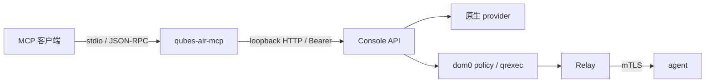

# MCP 接入

MCP 是 Console API 的非特权客户端，不直接持有 CA、provider 凭据或数据密钥。
本页描述当前实现；待办统一维护在 [TODO](TODO.md)，不再按已经结束的 Phase 1/2 重复叙述。

## 当前路径

入口为 `console/backend/cmd/qubes-air-mcp`，协议与工具注册在 `console/backend/internal/mcp`。
支持 initialize、tools/list、tools/call、ping。当前传输是 stdio；HTTP transport 尚未实现。
Console API 目标限制为 loopback，客户端拒绝重定向，避免凭据发送到其他目标。

## 工具与授权

| 类别 | 当前能力 | 启用条件 |
|---|---|---|
| 只读 | Qube、Zone、job、日志、监控概览、凭据元数据 | 默认注册；指标是否真实以 API placeholder 为准 |
| 控制 | 创建、启动/停止、suspend/resume、purge 等 API 操作 | MCP control scope，并持有 API 允许控制的 token |
| 桌面应用 | desktop_apps_list、desktop_app_launch | 显式 enable-computer-use；启动还需 control 权限 |
| 桌面帧/输入 | desktop_frame_get、desktop_input_send | 尚未实现，调用明确失败 |

MCP 不直接调用 service 层，认证、请求体上限与审计走 Console API 的同一条路径。
API 的 BodyLimit 默认 1 MiB；MCP 不以重复实现取代它。

Console 支持 `{name, token, scope}` token 配置，scope 为 read-only 或 control。已认证的
GET/HEAD/OPTIONS 请求可用只读 scope，其余方法需要 control。单一 api_token 按 control
处理；生产模式拒绝无 token 配置。按 zone/qube 的逐对象授权尚未实现。

Token 从环境或配置读取，不放命令行；凭据端点仅返回元数据。MCP 的 scope 与 API token
权限都应检查，不能只依靠 MCP 工具列表隐藏某个操作。purge 仍需名称确认，不绕过 API 语义。

## 桌面能力

应用列表通过 `GET /api/v1/qubes/{id}/appmenus` 调用 qubes.GetAppmenus；应用启动通过
`POST /api/v1/qubes/{id}/apps/{app}/launch` 调用 qubes.StartApp，app id 在上游调用前校验。
已有应用列表/启动原语不代表完整 computer-use 或桌面验收完成。

帧与输入需要实现 RFB/Xpra 客户端及既有通道适配。可见接管提示、随时中断、dom0 policy 和
输入授权是后续验收要求，不能描述为当前已提供的 UI。见 [MCP-01](TODO.md) 与 GUI-01。

## 验收

协议编解码、注册工具、作用域拒绝、未知工具、上游错误和超时已有测试；每次改动仍需实际
运行门禁。新增工具必须覆盖越权、非法输入和取消/失败路径。真实桌面验收另行记录，不能用
MCP 单元测试代替。整体信任边界还受 [agent 当前限制](grpc-transport-design.md#证书验证)约束。
