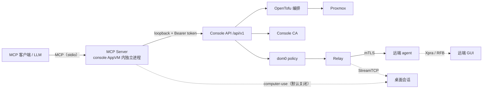

# MCP 接入设计

让 LLM 客户端（Claude Code / OpenClaw 等）通过 MCP 操作 Qubes Air 控制面，
并且**不新增任何特权路径**。

## 非目标

- 不实现第二套授权引擎：MCP 的授权就是 Console API 的授权。
- MCP 进程不持有 CA 私钥、云 API 凭据、Relay 私钥或 LUKS 密钥。
- 不绕过 dom0 policy。数据面调用与浏览器 / CLI 走完全相同的路径。
- 不对外监听。transport 只有 stdio，以及后续阶段绑定 loopback / Tailscale 的 HTTP。

## 架构

## 关键决定

### 1. 收口到 Console API

MCP server 不直接调用 service 层，而是作为 Console API 的 loopback HTTP 客户端。

这样认证、授权、请求体上限和审计只有一条路径，MCP 不可能拿到比 API 更大的权限。
代价是多一次本机 HTTP 往返 —— 值得，因为替代方案是把授权逻辑复制一份。

### 2. 工具分层

| 层 | 内容 | 默认 |
|---|---|---|
| 只读 | qube / zone / job / 日志 / 监控概览 / 凭据**元数据** | 注册 |
| 控制 | create / start / stop / suspend / resume / ack alert | 需要 `--scope control` |
| computer-use | 应用清单、启动应用、桌面帧、输入注入 | **不注册**，需要 `--enable-computer-use` |

写端点已经带上阶段新增的 `MaxBodySize` 中间件；MCP 侧不重复实现，只做转发。

### 3. 凭据处理

- 凭据类端点只回元数据，永不回 secret 值 —— 这一点由 Console API 决定，MCP 不额外放宽。
- MCP server 只持有 Console API 的 Bearer token。
- token 从环境变量或配置文件读，不进命令行参数（避免进 `ps`）。

### 4. computer-use 红线

这是最难收口的一层：它是「以用户身份操作图形界面」，不是「读数据」。

- 默认关闭，注册表里压根没有这些工具。
- 开启后仍需 dom0 policy `ask` 逐次确认。
- 本地必须有可见的「接管中」提示，且随时可中断。
- 复用既有 `qubesair.ConnectTCP` / `StreamTCP+`（Xpra / RFB），不新增对外端口。

## 分阶段

### Phase 1（本次落地）

- `internal/mcp`：JSON-RPC 2.0 + stdio 传输、`initialize` / `tools/list` / `tools/call` / `ping`
- `cmd/qubes-air-mcp`：stdio 主循环
- 工具：只读 + 控制两类，全部映射到既有 `/api/v1` 端点
- 作用域：在 MCP 层强制（`--scope`）
- computer-use 工具组**不注册**
- 测试：协议编解码、工具清单、作用域拒绝、上游 4xx/5xx 透传、超时、未知工具

### Phase 2（后续，未实现）

- Console 侧签发分域 token（read-only / control 各自的 token），把作用域从 MCP 层下推到 API 层
- computer-use 的帧与输入：接 StreamTCP（Xpra / RFB）
- HTTP transport：绑定 lo / Tailscale，复用同一套 Bearer 校验

## 验收

- `go test -race ./...` 通过
- `make BASE_REV=origin/main pre-commit` 通过
- 新增的安全控制都有失败路径测试：作用域拒绝、未知工具、上游错误、超时
