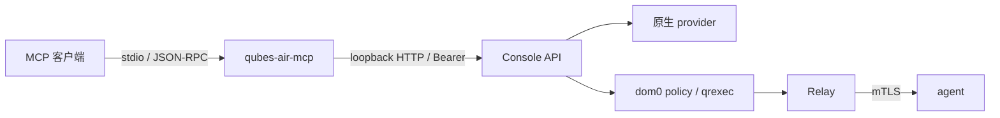

# MCP 接入

MCP 是 Console API 的非特权客户端，不直接持有 CA、provider 凭据或数据密钥。
本页描述当前实现；待办统一维护在 [TODO](TODO.md)，不再按已经结束的 Phase 1/2 重复叙述。

## 当前路径

```mermaid
flowchart LR
  Client["MCP 客户端"] -->|"stdio / JSON-RPC"| MCP["qubes-air-mcp"]
  MCP -->|"loopback HTTP / Bearer"| API["Console API"]
  API --> Provider["原生 provider"]
  API --> Policy["dom0 policy / qrexec"]
  Policy --> Relay["Relay"]
  Relay -->|"mTLS"| Agent["agent"]
```

入口为 `console/backend/cmd/qubes-air-mcp`，协议与工具注册在 `console/backend/internal/mcp`。
支持 initialize、tools/list、tools/call、ping。当前传输是 stdio；HTTP transport 尚未实现。
Console API 目标限制为 loopback，客户端拒绝重定向，避免凭据发送到其他目标。

## 工具与授权

| 类别 | 当前能力 | 启用条件 |
|---|---|---|
| 只读 | Qube、Zone、job、日志、监控概览、凭据元数据 | 默认注册；指标是否真实以 API placeholder 为准 |
| 控制 | 创建、启动/停止、suspend/resume、purge 等 API 操作 | MCP control scope，并持有 API 允许控制的 token |
| 桌面应用 | desktop_apps_list、desktop_app_launch | 显式 enable-computer-use；启动还需 control 权限 |
| 桌面帧/输入 | desktop_frame_get、desktop_input_send | 尚未实现，调用明确失败 |

MCP 不直接调用 service 层，认证、请求体上限与审计走 Console API 的同一条路径。
API 的 BodyLimit 默认 1 MiB；MCP 不以重复实现取代它。

Console 支持 `{name, token, scope}` token 配置，scope 为 read-only 或 control。已认证的
GET/HEAD/OPTIONS 请求可用只读 scope，其余方法需要 control。单一 api_token 按 control
处理；生产模式拒绝无 token 配置。命名 token 可再带 `zones` 白名单：Console API 的 `RequireZones`
对 MCP 发来的请求同样生效（其他 zone 的对象与不存在的对象返回 404，fleet 端点返回 403），判定规则见
[安全控制](security-controls.md#console-api-对象级授权)。这是按 zone 的对象级隔离，不是完整多租户，
也没有更细到单个 qube 的授权。

Token 从环境或配置读取，不放命令行；凭据端点仅返回元数据。MCP 的 scope 与 API token
权限都应检查，不能只依靠 MCP 工具列表隐藏某个操作。purge 仍需名称确认，不绕过 API 语义。

## 桌面能力

应用列表通过 `GET /api/v1/qubes/{id}/appmenus` 调用 qubes.GetAppmenus；应用启动通过
`POST /api/v1/qubes/{id}/apps/{app}/launch` 调用 qubes.StartApp，app id 在上游调用前校验。
已有应用列表/启动原语不代表完整 computer-use 或桌面验收完成。

帧与输入需要实现 RFB/Xpra 客户端及既有通道适配。`console/backend/internal/xpra` 已有受限的
Xpra 单次截图 wire 客户端（`GetScreenshot`），但**没有任何调用方**：desktop_frame_get 仍显式
失败，也没有桌面 stream 身份或授权；输入不在该包范围内。

交换过程按 Xpra 上游源码编写，读过的是 v5.0、v6.2、v6.3、v6.4 与 master 下 `xpra/server/` 的
hello 处理（`core.py`，v5.0 为 `server_core.py`/`server_base.py`）、截图处理（`mixins/display.py`
或 `subsystem/display.py`）、图像包构造（`x11/server/core.py`，v6.4 起为 `codecs/screenshot.py`）、
`net/protocol/socket_handler.py` 与 master 的 `net/packet_type.py`。客户端只发一个
`request=screenshot` 的 hello，服务端在 hello 处理里直接回一个图像包，不发服务端 hello。图像包在已发布的 6.x 中叫 `screenshot`，master
在关闭 `XPRA_BACKWARDS_COMPATIBLE`（默认开启）时叫 `display-screenshot`，两者都接受。客户端只读
一个 record：challenge（认证）、ssl-upgrade、disconnect/connection-close、服务端 hello（表示请求
未被处理）、0×0 空图或其他包都失败关闭。hello 同时带 `rencodeplus: true`（6.4 及以前按布尔能力
选编码器）与 `encoders` 列表、`compression_level: 0`、`chunks: false`；6.3 起服务端据此把 PNG
内联进包里。v5.0 与 v6.2 不读 `chunks`，超过 32 KiB 的 PNG 会作为 raw chunk 发送而被拒绝；v5.0
只认旧的 `screenshot_request` 标志（不发送），会把连接当作普通客户端处理而失败，`ui_client: false`
使它不会因此断开已连接的桌面客户端。以上只来自阅读源码，**尚未对真实 Xpra 服务端做过互通验证**。

对端数据的上限：单个 record 4 MiB，缓冲随实际收到的字节增长而不按声明长度预分配；嵌套 64 层；
每个包合计 65,536 个集合元素；十进制整数 20 字符；PNG 2 MiB、单边 8192、总像素 4 Mi；整个会话
10 s，超时或取消即关闭 stream。上限内的放大仍然可观（本地测量）：一个 64 KiB 的包含 65,536 个
空字典时解码分配约 8.7 MB；像素上限处的 16 位 RGBA PNG 完整解码分配约 34 MB。接线时需要限制
并发帧会话数。这些只由本地单元测试与 fuzz 覆盖。该包只依赖 Go 标准库，不包含 Xpra 或 rencode
的源码。

可见接管提示、随时中断、dom0 policy 和输入授权是后续验收要求，不能描述为当前已提供的 UI。
见 [MCP-01](TODO.md) 与 GUI-01。

## 验收

协议编解码、注册工具、作用域拒绝、未知工具、上游错误和超时已有测试；每次改动仍需实际
运行门禁。新增工具必须覆盖越权、非法输入和取消/失败路径。真实桌面验收另行记录，不能用
MCP 单元测试代替。整体信任边界还受 [agent 当前限制](grpc-transport-design.md#证书验证)约束。
