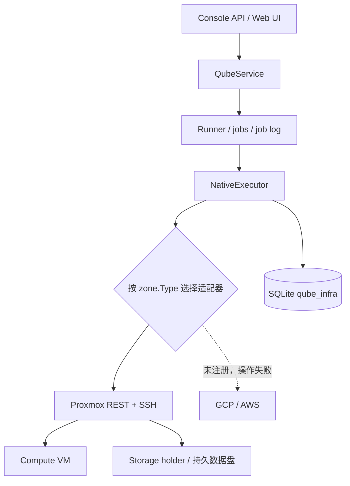

# Provider 原生编排

整理日期：2026-09-20。本文描述当前工作区实现。Proxmox 生命周期已有真机验收记录；
这不代表当前全部改动已提交、发布或完成回归。

## 当前边界

- 编排关闭时，`NoopExecutor` 只更新数据库状态，供本地开发使用。
- 编排开启时，`NativeExecutor` 按 zone 类型取得适配器；当前只注册 Proxmox。
- zone 无已注册适配器时明确失败。GCP/AWS 尚不可用于当前原生置备路径。
- provider 使用原生 API，当前仓库不再提供 Terraform/state 部署入口。
- Qubes 侧部署以 [qubes-salt-config](https://github.com/slchris/qubes-salt-config) 为准；
  本文不保存现场地址、VM 编号或临时构建 pin。

## 执行路径

代码入口：

| 位置 | 职责 |
|---|---|
| `console/backend/cmd/server/main.go` | 构造执行器，按 zone 解析凭据并注册 Proxmox |
| `console/backend/internal/provider/provider.go` | Adapter、Infra、Observed 与 registry 契约 |
| `console/backend/internal/provider/proxmox/` | PVE REST 客户端、生命周期、snippet 上传与 IP 分配 |
| `console/backend/internal/orchestrator/native.go` | 编排适配器步骤，保存资源身份，等待 agent 可达 |
| `console/backend/internal/repository/qube_infra_repo.go` | 资源身份持久化 |
| `console/backend/internal/service/reconcile.go` | 重启后的未完成 job 对账 |

## 资源身份与生命周期

`qube_infra` 按 Qube 记录 provider、节点、storage/compute VMID、数据卷、身份卷、观测状态
与 `protected`。它记录控制台已知的资源身份；provider 实际状态仍需通过 `Describe` 核验。

| 动作 | 当前步骤 |
|---|---|
| Provision | 预先记录 VMID → EnsureStorage → 记录卷 → 预先记录 compute VMID → EnsureCompute → 等待 agent 可达 |
| Resume | 复用已记录数据盘，EnsureCompute 并保存身份，等待 agent 可达 |
| Suspend / Release | StopCompute，保留 storage 与数据盘，更新记录 |
| Purge | 确认名称、原子记录 purge 意图并撤销身份，解除保护、删除当前 key，入队 Destroy |
| Destroy | 拒绝仍受保护的记录；StopCompute → 保存变化 → DestroyStorage/snippet → 逐资源核验 → 删除 infra 记录 |
| Status / Address | Describe，读取实际状态或地址 |

正常完成路径会更新 Qube 终态并处理 RemoteVM/端点。多步骤失败可能留下部分结果，必须检查
job log 和 provider；不能把数据库中的 `purged` 标签作为唯一销毁证据。

## 崩溃与重启

资源创建前必须持久化 VMID，创建请求写入所有权标记；重试同一身份并拒绝所有权不符的资源。
不能仅凭计算实例消失推断存储销毁。启动将 queued 标为 failed、running 标为 unknown，
Qube 恢复到 error，保留资源身份及不可逆 purge 意图；核对后显式重试原操作。
完整失败矩阵、存储可见性权限及恢复契约见[生命周期可靠性](reliability-design.md)。

## Bootstrap 与网络

身份内容由 `service/cloudinit.go` 渲染，包含 CA、单次 token 与 artifact digest，agent 私钥在
远端 guest 内生成。适配器优先使用已提供的共享存储身份卷；否则通过 SSH 上传 snippet，缺少
身份或所需 SSH 配置时返回错误。详见 [Bootstrap](bootstrap-design.md)。

PVE 节点管理地址由集群信息解析，provider 步骤写入 job log。Provision/Resume 接入 agent
可达性等待，超时返回失败；bootstrap 与健康扫描覆盖 creating/resuming，避免等待首证书时
相互阻塞。

zone 配置 `ip_pool` 和 `gateway` 时可下发静态地址，并在节点侧探测占用；未配置时用 DHCP。
静态池必须与 DHCP 地址分配范围分离，尚需现场验收；占用探测不能代替网段规划。

## 信任边界与已知限制

- zone 凭据按调用从加密库解析，SSH key 也在调用时读取；不能把凭据写入日志或文档。
- **PVE 管理 API**：执行器和调度器统一强制 HTTPS、CA/用途/目标身份/有效期校验并拒绝重定向，
  私有 CA 通过 Zone 的公共 `ca_pem` 配置。
- **节点 SSH**：必须配置已核验的 known_hosts；不再忽略服务器公钥。
- **agent 数据面**：角色与签名撤销状态检查已接入，配置和失效时间界限见
  [安全控制](security-controls.md)。这些控制仍需在真实部署中验收。
- **数据删除**：per-Qube key 从当前凭据库删除，不会同步清除历史备份中的密钥副本。恢复与销毁
  验收必须一起覆盖备份保留策略，见[灾难恢复](disaster-recovery.md)。

## 验收与下一步

已有现场记录覆盖原生 provider 生命周期和 Console → agent healthy 的完整链路，也记录了
节点管理地址解析、job log、可达性等待及缺失资源幂等销毁修复。本次未重跑现场验证。

下一轮验收应绑定源码版本和构建 digest，并覆盖：

1. provision → healthy → suspend → resume → healthy → release → purge；
2. purge 后分别核验 compute、storage holder、数据盘、证书与 RemoteVM；
3. 缺失资源、错误凭据、错误服务器身份、非法名称、超时与取消的失败路径；
4. 创建资源与保存身份之间崩溃、重复请求和重启对账；
5. 保留网段上的静态 IP 分配与冲突处理。

发布前完成 `make pre-commit`；里程碑及大范围安全改动还需 `make audit`。
未通过的测试或未执行的真机步骤需明确记录，见[路线图](roadmap-to-production.md)。
