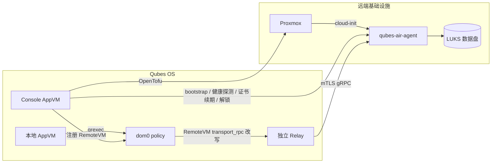

# Qubes Air

把 Qubes OS 的隔离模型延伸到 Proxmox 等远端基础设施：控制台负责置备，Qubes
`RemoteVM` 负责本地身份与 policy，独立 Relay 通过 mTLS gRPC 把 qrexec 调用转给远端
agent。

这是社区实现，不是 Qubes OS 官方项目。目前适合受控实验和继续开发，尚不是通用生产发行版。

## 当前状态

以下状态以仓库代码和 2026-07 的真机验收为准。

| 能力 | 状态 | 说明 |
|---|---|---|
| Web 控制台 | 已实现 | Go + Svelte；Zone、Qube、凭据、任务与设置管理，日志流式输出 |
| Proxmox 置备 | 已真机验证 | 从 UI 创建 VM，cloud-init 安装 agent，健康状态最终变为 `healthy` |
| 无私钥 bootstrap | 已真机验证 | cloud-init 只携带 CA 和单次 token；agent 在 guest 内生成私钥并提交 CSR |
| 存算分离 | 已真机验证 | suspend 释放计算实例，resume 挂回持久数据盘；支持 LUKS 数据盘 |
| RemoteVM + qrexec | 已真机验证 | 自动注册 RemoteVM、同步端点，经独立 Relay 调用远端 agent |
| gRPC 传输 | 已真机验证 | mTLS、零额外公网入站、证书续期、断线重连 |
| 远端操作 | 已真机验证 | `Ping`、`Exec`、`FileCopy` 和基于 `ConnectTCP` 的流式转发 |
| 无缝桌面 | 进行中 | Xpra、appmenu 与 `StartApp` 原语已加入，完整桌面体验仍在收尾 |
| GCP / AWS | 未完成 | GCP 资源已有实现但私网可达性未闭环；AWS 仍是接口骨架 |
| 监控 / 账单 | 占位 | 页面和 API 存在，尚未接真实指标与云账单 |

Qubes 侧的 Salt states 以
[qubes-salt-config](https://github.com/slchris/qubes-salt-config) 为唯一来源。

## 工作方式



几个重要边界：

- RemoteVM 是 dom0 中的元数据对象，不能 `qvm-start`。
- 正常 RemoteVM 调用的授权发生在本地 dom0 policy；当前证书角色隔离缺口见
  [路线图](docs/roadmap-to-production.md)，修复前不能把 CA 链验证当作完整授权。
- Relay 私钥在 Relay 本机生成；agent 私钥在远端 guest 内生成，两者都不经网络传输。
- 控制台持有基础设施凭据和 CA，因此不进入每次 qrexec 调用的数据面。
- gRPC/GUI 数据走 agent 的 mTLS 通道，不要求额外暴露远端应用端口。

完整说明见[架构文档](docs/architecture.md)和[传输设计](docs/grpc-transport-design.md)。

## 本地开发

只看 UI 或 API 时，不需要 Qubes、Proxmox、Go 或 Node 工具链：

```bash
docker compose up
```

打开 <http://127.0.0.1:5173>，登录 token 为 `devtoken`。这里使用的是写在
`docker-compose.yml` 里的临时凭据，不能用于真实环境。详细说明见
[本地开发](docs/local-dev.md)。

常用命令：

```bash
make build          # 构建后端和前端
make test           # Go 测试
make pre-commit     # 提交前完整增量门禁；规则见 AGENTS.md
make tf-validate    # OpenTofu 校验与格式检查
make agent-deb      # 构建 linux/amd64 agent 包
```

前端额外检查：

```bash
cd console/frontend
npm ci
npm run check
npm run build
```

## 真机部署

真机部署分属两个仓库：

1. 在 [qubes-salt-config](https://github.com/slchris/qubes-salt-config) 安装并配置 Qubes
   模板、`qubesair-console`、Relay、vault 和 dom0 policy。
2. 在本仓库构建控制台、agent 和 Terraform/OpenTofu 配置。
3. 通过控制台录入 Zone 与凭据，创建远端 Qube。
4. 用 `qrexec-client-vm <remotevm> qubesair.Ping` 验证 RemoteVM 链路。

按[快速入门](docs/quickstart.md)和 qubes-salt-config 的部署清单操作；
`dom0-scripts/init-qubes-air.sh` 不是当前安装入口。

## 仓库结构

| 路径 | 内容 |
|---|---|
| `console/backend/` | 控制台 API、编排、PKI、agent 与 gRPC transport |
| `console/frontend/` | Svelte Web UI |
| `terraform/` | 多 provider 资源、存算分离和 state 加密示例 |
| `remote/` | 远端 qrexec 服务和桌面启动脚本 |
| `relay/` | Relay 上的 qrexec transport handler |
| `packaging/agent-deb/` | agent Debian 包 |
| `dom0-scripts/` | RemoteVM/policy 辅助脚本；部署入口以 qubes-salt-config 为准 |
| `crypto/` | 本地密钥生成与轮换工具 |
| `docs/` | 当前文档入口和专题说明 |

## 文档

从[文档索引](docs/README.md)进入。最常用的是：

- [快速入门](docs/quickstart.md)
- [架构与信任边界](docs/architecture.md)
- [RemoteVM 真机操作](docs/runbook-remotevm.md)
- [凭据与密钥](docs/credential-vault.md)
- [OpenTofu state](docs/terraform-state.md)
- [当前路线图](docs/roadmap-to-production.md)

## 尚未完成

- 收尾无缝桌面：菜单同步、单击启动、断线恢复与多窗口验收。
- 补齐 GCP 私网可达性以及 AWS 真实资源。
- 把监控、告警和账单页接到真实数据源。
- 完成生产级身份体系、审计、备份/恢复和大规模多租户设计。
- 删除未使用的 transport、脚本和过期注释。

具体优先级见[路线图](docs/roadmap-to-production.md)。

## 安全提示

真实环境必须设置独立的 API token、32 字节加密密钥、受限 CORS 和加密 state。不要把
云凭据、CA 私钥、LUKS 密钥、Relay/agent 私钥提交到 Git。凭据存放、轮换和销毁步骤见
[凭据文档](docs/credential-vault.md)与[销毁流程](docs/credential-destruction.md)。
