# Qubes Air

将 Qubes OS 的安全隔离能力扩展到云端和物理分离设备

> **文档说明**：本 README 同时包含**目标设计蓝图**和**当前实现状态**两部分内容。
> 带有 `[已实现]` / `[部分实现]` / `[蓝图]`（设计蓝图，尚未实现）标记的章节请以标记为准。
> 未标记的架构、命令和目录树多为**设计蓝图**，描述的是项目的目标形态，而非当前可运行的功能。

## 项目状态（Project Status）

**当前阶段：provision 链路已在真机跑通；跨机 qrexec 与 gRPC 传输仍待验证。** 项目已按一轮深度设计评审重构：放弃了原来的自造隧道方案，转向官方 **RemoteVM**。**2026-07 在真实 Qubes R4.3 + Proxmox「infra」集群上跑通了完整 provision 闭环**：从控制台 Web UI 建机 → Terraform apply → PVE 克隆模板 901（compute/storage 分离）→ cloud-init 从局域网 artifact store 装 agent → 控制台经 mTLS 探活确认 `agent_health: healthy`。控制台自身也部署在专属 `qubesair-console` qube 上，经 `qvm-connect-tcp` 访问。**仍未验证**的是 provision 之后的那一段——把远端机器注册成 dom0 认识的 RemoteVM、跨机 qrexec 调用、以及目标 gRPC 传输（都尚未实现或未上真机）。请在使用前了解以下现状。

### 现在能做什么（代码层面已实现且有测试/校验）

- [真机验证] **管理控制台**：Go(Gin) 后端 + Svelte 5 前端。`/api/v1` 有 **Bearer 认证**（constant-time 比较）、CORS 已收敛、坏密钥 fail-fast。**已部署在专属 `qubesair-console` qube 上并跑通**：Web UI 经 `qvm-connect-tcp` 访问、无 token 时进登录门、Zones/Qubes 视图读真实集群数据、**provision 期间 terraform 日志实时滚动**（`GET /jobs/:id/log` 增量拉取）。前端资源与二进制均从局域网 artifact store 下发、按 SHA256 钉版。
- [真机验证] **存算分离 Terraform**：`terraform/` 用真实 resource 实现 compute/storage 拆分——`compute_running` 开关切换"释放计算/重建挂回数据盘"，数据盘 `prevent_destroy`。**Proxmox 已真机 apply**：模板 901 克隆到目标节点、storage VM 常关机、cloud-init snippet 经 SSH 上传节点（`/var/lib/vz/snippets/`）。GCP/AWS 仍为接口对齐骨架。（见 [docs/terraform-state.md](docs/terraform-state.md)）
- [真机验证] **控制台接真实动作**：`Qube.Start/Stop` 触发 Terraform 的 Resume/Suspend（**先落地再改状态**），经可注入 executor + qubeName 白名单防注入。**已在真机上从 UI 建机、observe job、看到 healthy agent。**
- [部分实现] **RemoteVM + 零入站传输**：dom0 侧 RemoteVM 创建、**修正后的 qrexec policy**（方向正确、Relay 不得直达 dom0、破坏性操作 `ask`）已实现，配置用 bind-dirs 持久化。
  - **传输层现状**：现有骨架用 `qubesair.SSHProxy` transport（autossh 出站 + `ssh -R` 反向调用），可作过渡参考。（见 [docs/runbook-remotevm.md](docs/runbook-remotevm.md)）
  - [TODO] **目标传输已改为 gRPC 双向流**：本地 relay 作为 gRPC 客户端**主动出站**建连到远端，建立**长连接双向流**，qrexec 请求转发与反向回程都复用同一条流（零入站、只出站）。gRPC 传输**尚未实现**，落地路线见 [docs/roadmap-to-production.md](docs/roadmap-to-production.md)。
- [已实现] **凭据 vault + 轮换**：云凭据/passphrase 存无网络的 `vault-cloud`，经 `qubesair.GetCredential`（dom0 `ask`）按需下发、**不落盘**；控制台凭据 AES-256-GCM 加密，支持**多版本密钥的原子轮换**（`cmd/rotate-key`）。（见 [docs/credential-vault.md](docs/credential-vault.md)）
- [已实现] **多机 state backend**：OpenTofu 客户端加密（PBKDF2）+ S3 兼容 / pg 双 backend，密钥全走 vault、云厂商只见密文。
- [已实现] **辅助脚本**：`crypto/scripts/` 密钥生成、SOPS 加密、密钥轮换（`rotate-keys.sh`）可独立使用。

### 现在还不能做什么 / 需要真机验证（重要）

- [已真机跑通] ~~尚未在真实 Qubes R4.3 + Proxmox 上跑通端到端~~ —— **provision 段已跑通**（见上）。真实 `apply` 已执行；**跨机 qrexec 调用仍未验证**（见下一条）。
- [待真机验证] **RemoteVM 注册 + 跨机 qrexec 是缺口的下一段。** provision 只是把机器建出来；要让它"像本地 qube"用，还需 `qvm-create --class RemoteVM` 把它注册进 dom0、设 `relayvm`/`transport_rpc`/`remote_name`，再从**本地 qube**（不是 dom0）发 `qrexec-client-vm`。这一段尚未打通，能做什么/不能做什么见 [docs/remotevm-alignment.md §5.5](docs/remotevm-alignment.md)（源码级结论：文件复制/Split-GPG 原生工作，剪贴板与图形界面架构上不可能）。
- [待真机验证] **GCP/AWS 的 compute/storage 为骨架 TODO**（接口已对齐，未实现真实资源）。Proxmox 已真机验证。
- [待真机验证] **gRPC 双向流传输尚未实现**（目标传输，SSHProxy 骨架作过渡参考）。
- [已移除] **`salt/qubes-air/` 整个骨架已退役**（sys-remote + WireGuard 网关方向错误、states 断链；RemoteVM 的 autossh/`ssh -R` 骨架被 gRPC 传输取代）。Qubes 侧 states 的单一来源是 **qubes-salt-config** 仓库的 `salt/mgmt/`；退役说明与新旧对照表见 [salt/qubes-air/README.md](salt/qubes-air/README.md)。
- [部分实现] **监控 / 账单仍为占位**：已显式标注 `placeholder`，未接真实成本源。

### 路线图（诚实版）

已完成：API 认证 + 弱密钥 fail-fast + CORS 收敛；存算分离 Terraform；RemoteVM 创建 + 修正 qrexec policy + 零入站传输骨架（SSHProxy）；凭据 vault + 密钥轮换；控制台接真实 Suspend/Resume；多机加密 state backend。

**已真机跑通（2026-07，Proxmox「infra」集群）**：控制台部署在专属 `qubesair-console` qube；从 Web UI 建机 → Terraform apply → PVE 克隆 → cloud-init 装 agent → mTLS 探活 `healthy`，全链路可见（provision 日志实时）、可查（失败带 terraform 错误）。过程中修掉 ~10 个"报告成功、后面才炸"型真机 bug（`/usr/local` 对 AppVM 不可见、`coalesce(x,"")` 必失败、cloud-init snippet 必须 SSH 上传节点等）。

[TODO] **RemoteVM 注册 + 跨机 qrexec**（provision 之后的下一段，让远端机器"像本地 qube"用）。
[TODO] 传输层从 SSHProxy 骨架切换到 **gRPC 双向流**（目标传输，尚未实现）。

下一步：**打通 RemoteVM 注册通道**（B 方案：console 经受限 qrexec 把机器注册进 dom0，见 [docs/remotevm-alignment.md](docs/remotevm-alignment.md)）→ 补齐 GCP/AWS 真实资源 → 图形访问经 `qubes.ConnectTCP` 隧道 VNC/RDP。详见文末[路线图](#路线图)。

---

## 项目概述

Qubes Air 是 Qubes OS 官方愿景的社区实现方案。官方 Qubes Air 概念由 Joanna Rutkowska 于 2018 年提出，旨在将 Qubes OS 的安全隔离模型从本地 Xen 虚拟化泛化到多种隔离技术和平台。

本项目通过 Terraform 和 SaltStack 实现 Qubes Air 的核心理念，让用户可以在 PVE、GCP、AWS 等平台上创建和管理远程 Qube，甚至可以在物理分离的设备(如 Raspberry Pi)上运行 Qube，突破本地硬件限制，同时保持 Qubes OS 的安全架构和使用体验。

### 官方 Qubes Air 愿景

根据 Qubes OS 官方文章，Qubes Air 的核心思想是:

**解决的问题:**
- 部署成本高: 难以找到兼容 Qubes OS 的硬件
- 单点故障: 过度依赖 Xen 虚拟机管理程序
- 硬件限制: 本地资源无法满足所有计算需求

**核心理念:**
- Qube 不等于 VM: Qube 是一个隔离的容器，可以是 Xen VM、云端 VM、容器，甚至是物理分离的设备
- 隔离技术多元化: 通过在不同平台运行 Qube，分散对单一隔离技术的依赖
- 统一管理接口: 无论 Qube 在哪里运行，都通过 Qubes Admin API 和 qrexec 统一管理

### 官方 Qubes Air 最新动态（2018 → 2025）

官方方向自 2018 年愿景以来已有明显演进，本项目在跟进对齐中：

| 时间 | 事件 | 对本项目的含义 |
|------|------|----------------|
| 2018-01 | Rutkowska 发表 [Qubes Air 愿景](https://blog.invisiblethings.org/2018/01/22/qubes-air.html)：把隔离模型从本地 Xen 泛化到多平台 | 本项目的初始蓝图来源 |
| 2022 | Summit：演示 **qrexec-over-network** PoC | 证明跨机 qrexec 可行 |
| 2024 | Summit：明确**不做在线/离线迁移**（vMotion 式实时迁移成本过高） | 本项目同样**不做迁移**，专注远程 Qube 的创建与管理 |
| 2025-09 | [Summit 2025（柏林）](https://blog.3mdeb.com/2025/2025-10-20-qubes-os-summit-2025-berlin/)：**RemoteVM** PoC 落地——通过 **qrexec 委派**把敏感任务派发到远程 VM，现场演示基于 qrexec policy 的本地↔远程文件复制 | **官方给出了跨机信任边界的"官方答案"**：qrexec/RemoteVM，而非私有隧道协议 |
| 2025-09 | Summit 2025：Qubes Air 被重新定位为**服务器/云端的硬件+固件地基**（AMD EPYC、Dasharo coreboot+UEFI、OpenBMC/ZarhusBMC、**AMD SEV** 内存加密、TrenchBoot attestation） | 目标口径变为 *"Qubes in the cloud" + "Hybrid Mode"*，强调**可认证的服务器级 Qubes** |
| 2025-12 | [Qubes OS 4.3.0 发布](https://www.qubes-os.org/news/2025/12/21/qubes-os-4-3-0-has-been-released/)（Fedora 41 dom0、Xen 4.19、新 Devices API） | RemoteVM 相关能力在此版本一带铺路 |
| 至今 | 官方态度：*"There is no plan or agenda at all... main Qubes OS development takes already all the bandwidth."*（[论坛](https://forum.qubes-os.org/t/updates-on-qubes-air/19709)） | **Qubes Air 仍是探索性方向，官方无排期**——社区实现（本项目）仍有价值 |

> **[蓝图] 对齐待办**：本项目当前的 `sys-remote + WireGuard 网关 + 自定义 qrexec 服务` 方案，是在官方 RemoteVM 落地**之前**的自造设计。方向一致（都走 qrexec），但**尚未对齐 R4.3 的 RemoteVM 原语**（`RemoteVM` 类 + `relayvm` / `transport_rpc` / `remote_name` 属性）。
>
> **[TODO] 传输层选型**：官方 RemoteVM 参考传输为 Relay 上的 `qubesair.SSHProxy`（SSH 隧道）。本项目**目标传输已改为 gRPC 双向流**——relay 作为 gRPC 客户端出站建连、长连接双向承载 qrexec 转发与反向回程，零入站。SSHProxy 骨架保留作过渡参考；gRPC 传输尚未实现，详见 [docs/roadmap-to-production.md](docs/roadmap-to-production.md)。
>
> 详细的机制拆解、现状差异对照与落地方案见 **[docs/remotevm-alignment.md](docs/remotevm-alignment.md)**。核心结论：应放弃自造私有隧道，改在官方 RemoteVM 之上构建，并复用 [qubes-salt-config](https://github.com/slchris/qubes-salt-config) 里现有的 `mgmt-jump` 作为 Relay。

### 关于迁移功能的说明

与官方一致，本项目**不实现在线/离线迁移**：

- **在线迁移**：类似 VMware vMotion 的实时迁移技术，开发成本极高
- **离线迁移**：关机后传输 VM 的功能，可能在长期规划中实现

目前，`qubes-backup` 可以满足在不同机器间转移 Qube 的基本需求。本项目侧重于远程 Qube 的创建和管理，而非迁移。

## 核心目标

- **扩展性**: 突破本地硬件限制，利用云端算力和存储
- **安全性**: 通过隔离技术多元化，降低单一技术漏洞的影响
- **一致性**: 与本地 Qube 相同的管理方式，使用 Salt 进行配置管理
- **灵活性**: 按需创建/销毁远程资源，优化成本

## 使用场景

| 场景 | 说明 |
|------|------|
| 高性能计算 | 将 GPU 密集型任务卸载到云端 VM |
| 大容量存储 | 云端 Qube 处理大文件，避免占用本地空间 |
| 地理分布 | 在不同区域部署 Qube 用于特定网络访问 |
| 临时扩展 | 临时任务使用云端一次性 VM，用完即销毁 |
| 灾备冗余 | 关键 Qube 在云端保持备份实例 |
| 隔离多元化 | 敏感 Qube 运行在不同云平台，分散风险 |
| 物理隔离 | 高敏感任务在物理分离设备上运行 (如 Raspberry Pi) |

## 系统架构

> **[蓝图] 本章节为设计蓝图（目标架构），描述项目希望达到的形态，尚未在代码中实现。** 当前真实实现请见文首「项目状态」。

### Qubes Zones 概念

Qubes Air 引入了 "Zone" (区域) 的核心概念，每个 Zone 包含:

- **隔离技术**: 实现 Qube 的底层技术 (Xen VM、云 VM、容器、物理设备)
- **通信机制**: Zone 内 Qube 间的通信方式 (Xen Grant Tables、网络等)
- **本地 Admin Qube**: 管理 Zone 内所有 Qube，可以是 Master 或 Slave 模式
- **本地 GUI Qube** (可选): 聚合 Zone 内 Qube 的图形界面
- **存储技术**: Zone 内 Qube 的存储实现方式

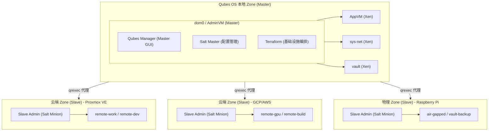

### 混合模式 (Hybrid Mode)

用户可以同时运行:
- 本地 Qube: 低延迟、高隐私需求的任务
- 云端 Qube: 高性能计算、大存储需求
- 物理分离 Qube: 极高安全需求 (如密钥管理)

不同 Zone 的 Qube 可以通过 qrexec 服务透明通信，用户无需关心 Qube 的实际位置。

### 隔离多元化的安全优势

通过将 Qube 分布在不同平台:

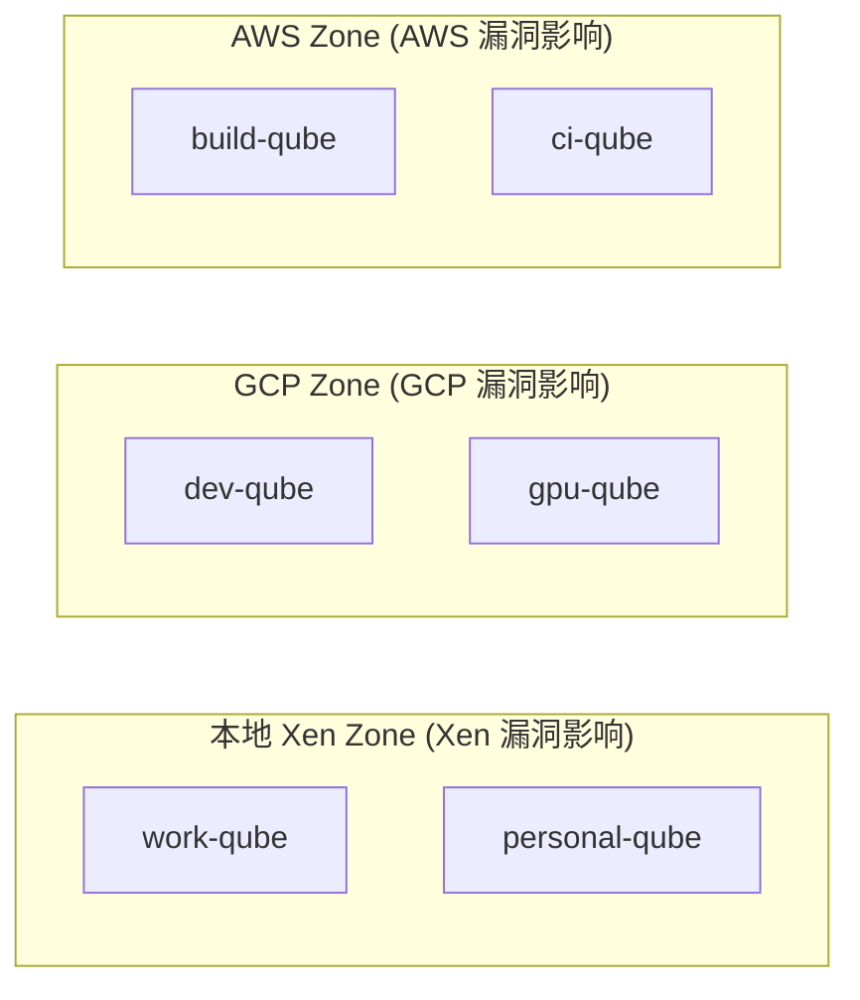

如果某个平台 (如 Xen) 发现严重安全漏洞，只有该 Zone 内的 Qube 受影响，其他 Zone 的 Qube 保持安全。

## 与本地 Qube 的集成

### Qube 接口规范

根据官方 Qubes Air 设计，一个 Qube 应实现以下接口:

1. **vchan 端点**: 底层通信通道，可基于 Xen 共享内存、TCP/IP 等实现
2. **qrexec 端点**: 基于 vchan 的服务调用机制，确保 Qubes Apps (Split GPG、PDF 转换器等) 正常工作
3. **GUI 端点** (可选): 图形界面协议端点
4. **网络接口**: 一个上行接口，可选多个下行接口 (用于代理 Qube)
5. **存储卷**: 只读 root 卷 + 可读写 private 卷 (支持模板机制)

### 管理方式对比

| 功能 | 本地 Qube | 远程 Qube (Qubes Air) |
|------|-----------|----------------------|
| 创建/销毁 | qvm-create/qvm-remove | terraform apply/destroy + Admin API |
| 配置管理 | qubesctl (Salt) | qubesctl + 远程 Salt Minion |
| 服务调用 | qrexec (本地) | qrexec (跨 Zone 代理) |
| 网络策略 | Qubes Firewall | 云平台 Security Group + 本地策略 |
| 文件传输 | qvm-copy-to-vm | 通过 qrexec 代理传输 |
| 剪贴板 | Qubes 安全剪贴板 | 通过安全通道同步 (延迟较高) |
| GUI | Qubes GUI Protocol | GUI Protocol + RDP/VNC 聚合 |

### GUI 虚拟化考虑

Qubes GUI 协议为安全优化，牺牲了压缩等性能特性。在远程 Zone 中:

- Zone 内: 使用 Qubes GUI Protocol (快速，因为同 Zone 内通信快)
- Zone 间: 使用 RDP/VNC 等高效协议聚合到 Master GUI Qube
- 本地 Qube: 保持原有低延迟体验

## 远程 Qube 分类

| Qube 类型 | 用途 | 适合平台 | 网络策略 |
|-----------|------|----------|----------|
| remote-work | 远程办公、文档协作 | PVE/GCP | 通过 sys-remote 访问 |
| remote-dev | 代码开发、大型编译 | GCP/AWS | 按需访问 |
| remote-gpu | GPU 计算、AI/ML 任务 | GCP/AWS | 受限访问 |
| remote-data | 大容量数据处理 | PVE/AWS | 内网隔离 |
| remote-build | CI/CD、自动化构建 | GCP/AWS | 按需访问 |
| remote-disp | 一次性任务 | 任意 | 临时配置 |
| air-gapped | 物理隔离的高安全任务 | Raspberry Pi/USB Armory | 完全隔离 |

## 技术栈

### 核心组件

| 组件 | 技术选型 | 说明 |
|------|----------|------|
| 基础设施编排 | Terraform | 跨平台创建/管理云端 VM |
| 配置管理 | SaltStack | 与 Qubes OS 原生 Salt 集成，实现 qubesctl 统一管理 |
| 镜像构建 | Packer | 预构建远程 Qube 模板 |
| 辅助工具 | Ansible | 初始化引导、Salt Minion 部署 |
| 状态存储 | 本地加密 / Vault Qube | 状态文件安全存储 |
| 通信层 | qrexec over vchan | Zone 间 qrexec 代理，基于 TCP/IP 实现 vchan |

### 管理控制台技术栈

考虑到 Qubes OS 的 GPU 驱动限制和安全要求，管理控制台采用轻量级设计。

> **[部分实现] 实现状态**：后端与前端骨架**已实现**（CRUD + 加密存储 + 编排层）；API 已有 **Bearer token 认证**（constant-time）。下表中 gRPC、OAuth2/mTLS（更强身份）、多租户 RBAC 仍为 **[蓝图]**。

#### 后端

| 组件 | 技术选型 | 实际状态 | 说明 |
|------|----------|----------|------|
| 语言 | Go (Golang) | Go 1.24 | 高性能、静态编译、内存安全 |
| Web 框架 | Gin | 已用 Gin | 轻量级 HTTP 框架 |
| API 风格 | REST（+ gRPC 规划中） | 仅 REST | REST 供前端调用；gRPC 尚未实现 |
| 认证 | Bearer token（→ OAuth2/mTLS 规划） | Bearer 已实现 | `/api/v1` 需 Bearer token（constant-time 比较）；空 token 放行并告警。OAuth2/mTLS/RBAC 为蓝图 |
| 数据库 | SQLite | 已用 SQLite | 嵌入式数据库，无外部依赖 |

**Go 后端设计原则:**
- 静态编译，单二进制部署，减少依赖
- 最小化外部库依赖，降低供应链攻击风险
- 定期更新到最新 Go 版本，获取安全修复
- 使用 Go 原生加密库，避免 CGO

#### 前端

| 组件 | 技术选型 | 版本要求 | 说明 |
|------|----------|----------|------|
| 框架 | Svelte / SolidJS | >= 5.0 / >= 1.8 | 轻量级响应式框架，编译后体积小 |
| UI 库 | Skeleton UI / DaisyUI | 最新稳定版 | 轻量 CSS 框架，无重 JS 依赖 |
| 构建工具 | Vite | >= 5.0 | 快速构建，tree-shaking 优化 |
| 状态管理 | 框架内置 | - | 避免额外状态库开销 |

**前端设计原则 (针对 Qubes OS GPU 限制):**
- 禁用 CSS 动画和过渡效果 (`prefers-reduced-motion`)
- 不使用 WebGL、Canvas 复杂渲染
- 避免大量 DOM 操作和虚拟滚动
- 使用系统原生字体，不加载 Web 字体
- 静态资源本地化，不依赖 CDN
- 支持纯 HTML 降级模式

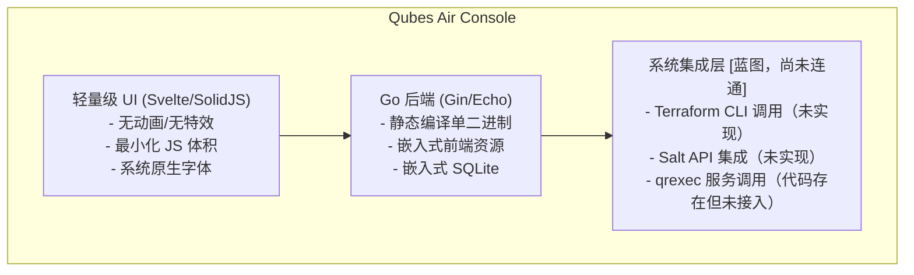

> **[未实现]** 上图"系统集成层"是**目标形态**。当前后端**不调用** Terraform / Salt，qrexec 客户端代码存在但**未被任何 service 调用**。这是从"模拟"走向"MVP"最关键的缺失环节。

#### 安全加固

| 措施 | 说明 |
|------|------|
| 依赖审计 | 使用 `govulncheck` 和 `npm audit` 定期扫描 |
| 最小依赖 | 仅使用必要的第三方库 |
| SRI 校验 | 静态资源完整性校验 |
| CSP 策略 | 严格的内容安全策略 |
| 输入验证 | 所有输入严格验证和转义 |
| 认证加固 | 支持 YubiKey / TOTP 二次认证 |

#### 部署方式

```bash
# 单二进制部署 (前端资源嵌入)
[user@dom0 ~]$ ./qubes-air-console serve --port 8443 --tls

# 或作为 Qube 内的服务运行
[user@admin-qube ~]$ qubes-air-console serve
```

### SaltStack 集成架构

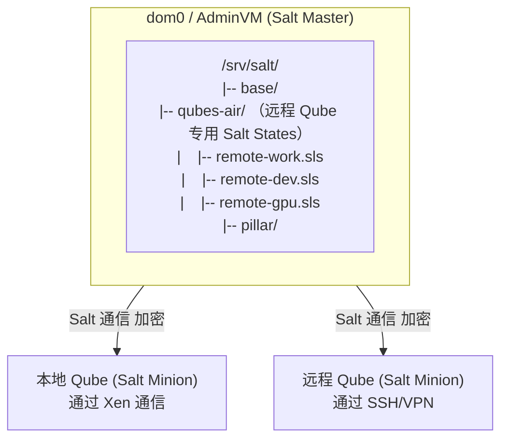

### 为什么需要 SaltStack + Ansible

| 工具 | 职责 | 原因 |
|------|------|------|
| SaltStack | 持续配置管理 | Qubes OS 原生使用 Salt，保持一致性 |
| Ansible | 初始引导 | Salt Minion 部署前的初始化配置 |
| Terraform | 基础设施 | 云平台 VM 生命周期管理 |

### 支持平台 (Zones)

| 平台/Zone 类型 | Provider/技术 | 适用场景 |
|----------------|---------------|----------|
| Proxmox VE | bpg/proxmox | 私有云/家庭实验室/自托管 |
| Google Cloud | hashicorp/google | 公有云、GPU 实例 |
| AWS | hashicorp/aws | 公有云、全球覆盖 |
| Azure | hashicorp/azurerm | 公有云、企业集成 |
| Raspberry Pi | SSH + Salt | 物理隔离 Zone，高安全需求 |
| USB Armory | SSH + Salt | 便携式物理隔离设备 |

### 远程 Qube 操作系统

- **推荐系统**: Fedora (与 Qubes OS 模板保持一致)
- **备选系统**: Debian、Ubuntu
- **轻量系统**: Alpine (适合一次性 Qube、物理设备)
- **匿名系统**: Whonix Gateway/Workstation
- **嵌入式**: Raspbian (Raspberry Pi Zone)

## 网络架构

### Zone 间通信: qrexec 代理

在 Qubes Air 中，Zone 间的 qrexec 服务调用通过代理实现:

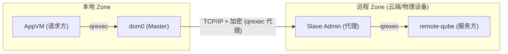

### sys-remote: 远程 Zone 网关

在 Qubes OS 中创建专用的 `sys-remote` ServiceVM，作为所有远程 Zone 的网络网关：

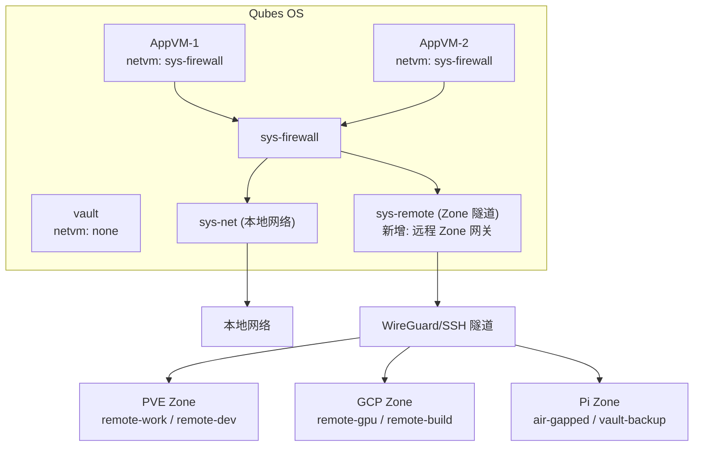

### 网络安全策略

1. **隧道加密**: 所有 Zone 间通信通过 WireGuard 或 SSH 隧道
2. **双重防火墙**: 云平台 Security Group + Qubes 防火墙规则
3. **最小暴露**: 远程 Qube 仅开放必要端口给 sys-remote
4. **证书认证**: 使用证书而非密码进行身份验证
5. **Zone 隔离**: 不同 Zone 间默认无法直接通信，必须通过 Master Admin 代理

## 安全设计

> **[蓝图] 本章节（威胁模型、隔离多元化、HSM/KMS 集成、密钥层级、磁盘加密等）为目标安全设计蓝图，绝大部分尚未在代码中实现。** 其中的 Terraform `aws_kms_key` / `google_kms_crypto_key`、`disk-encryption.sls`、Split GPG 工作流等均为示例，仓库中并无对应实现。
>
> **当前真实的安全现状**请以文首「项目状态」为准。已落地的正面项：Bearer 认证 + 坏密钥 fail-fast + CORS 收敛、凭据 AES-256-GCM 加密 + 多版本密钥原子轮换、vault-cloud 按需下发凭据（不落盘）、修正后的 qrexec policy（Relay 不得直达 dom0）、OpenTofu 客户端加密的多机 state backend。仍待真机验证的是端到端链路（见文首）。

### 威胁模型

| 威胁 | 缓解措施 |
|------|----------|
| 云平台被入侵 | 远程 Qube 不存储长期敏感数据，使用后销毁 |
| 云平台数据泄露 | 所有数据加密存储，密钥由本地或 HSM 管理 |
| 单一隔离技术漏洞 | 隔离多元化: 敏感 Qube 分布在不同 Zone |
| 网络监听 | 全程加密隧道，证书双向认证 |
| 凭证泄露 | 临时凭证、短期 Token、硬件密钥 |
| 横向移动 | 每个远程 Qube 独立隔离，Zone 间通信受控 |
| Xen/KVM 漏洞 | 高敏感任务在物理隔离 Zone (如 Raspberry Pi) 运行 |
| 数据篡改 | 使用 Split GPG 签名验证数据完整性 |
| 密钥泄露 | 主密钥永不离开安全环境，使用 HSM 保护 |

### 隔离多元化策略

根据 Qube 的敏感程度分配到不同 Zone:

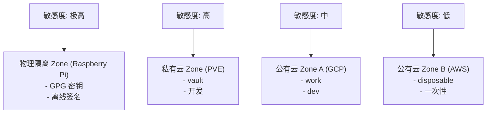

### 密钥管理

- 云平台凭证存储在本地 vault Qube 中
- SSH 密钥使用 split-ssh 架构，私钥不离开 vault
- 支持 YubiKey 等硬件密钥进行身份验证
- Terraform 状态文件加密存储

### HSM 与密钥安全架构

远程 Qube 中的数据不能以明文形式存储在云端，需要完整的加密和签名机制:

#### 密钥生成策略

| 策略 | 实现方式 | 适用场景 | 安全级别 |
|------|----------|----------|----------|
| 本地生成 | vault Qube 或物理隔离设备生成密钥 | 高敏感数据、长期密钥 | 极高 |
| 云端 HSM | AWS CloudHSM / GCP Cloud HSM / Azure Key Vault | 云端数据加密、合规需求 | 高 |
| 混合模式 | 本地主密钥 + 云端派生密钥 | 平衡安全与便利 | 高 |

#### 加密架构

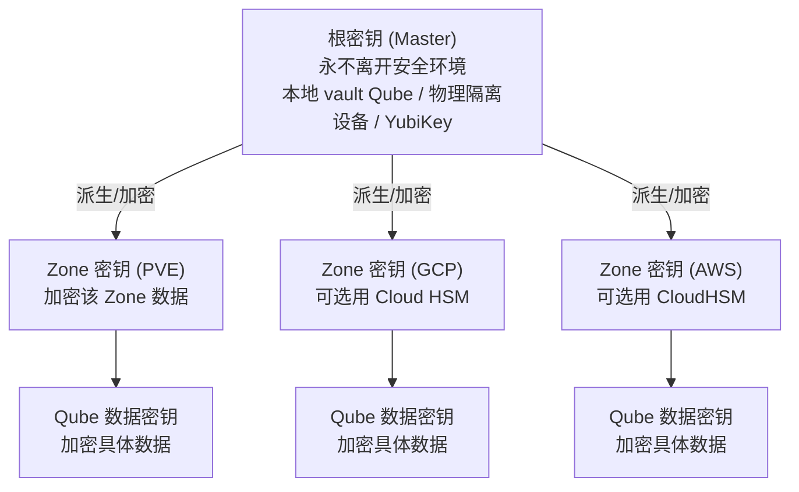

#### 云平台 HSM 集成

**AWS CloudHSM / KMS:**
```hcl
# terraform 配置示例
resource "aws_kms_key" "qubes_air_zone_key" {
  description             = "Qubes Air Zone encryption key"
  deletion_window_in_days = 30
  enable_key_rotation     = true
  
  policy = jsonencode({
    Version = "2012-10-17"
    Statement = [
      {
        Effect = "Allow"
        Principal = { AWS = var.qubes_air_role_arn }
        Action = [
          "kms:Encrypt",
          "kms:Decrypt",
          "kms:GenerateDataKey"
        ]
        Resource = "*"
      }
    ]
  })
}
```

**GCP Cloud HSM / KMS:**
```hcl
resource "google_kms_key_ring" "qubes_air" {
  name     = "qubes-air-keyring"
  location = var.region
}

resource "google_kms_crypto_key" "zone_key" {
  name            = "zone-encryption-key"
  key_ring        = google_kms_key_ring.qubes_air.id
  rotation_period = "7776000s"  # 90 days
  
  # 使用 HSM 保护级别
  version_template {
    algorithm        = "GOOGLE_SYMMETRIC_ENCRYPTION"
    protection_level = "HSM"
  }
}
```

#### 本地密钥生成 (推荐高敏感场景)

```bash
# 在物理隔离 Zone (如 Raspberry Pi) 或 vault Qube 中生成主密钥
[user@vault ~]$ gpg --full-generate-key --expert
# 选择 ECC (Curve 25519) 或 RSA 4096

# 导出公钥供远程 Qube 使用
[user@vault ~]$ gpg --armor --export <key-id> > qubes-air-master.pub

# 使用 Split GPG 架构，私钥永不离开 vault
[user@remote-qube ~]$ qubes-gpg-client --encrypt --recipient <key-id> sensitive-data.tar
```

#### 数据加密工作流

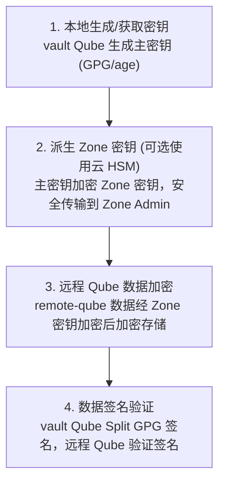

#### 支持的加密工具

| 工具 | 用途 | 集成方式 |
|------|------|----------|
| GPG + Split GPG | 文件加密、签名 | Qubes 原生支持 |
| age | 现代加密工具 | Salt State 配置 |
| LUKS | 磁盘全盘加密 | 远程 Qube 默认启用 |
| Vault (HashiCorp) | 密钥管理、动态凭证 | 可选部署在私有 Zone |
| SOPS | 加密配置文件 | 与 Terraform/Salt 集成 |

#### Salt Pillar 加密

敏感配置使用 GPG 加密存储:

```yaml
# /srv/pillar/qubes-air/credentials.sls
# 使用 GPG 加密的 Pillar 数据

#!yaml|gpg

cloud_credentials:
  aws:
    access_key: |
      -----BEGIN PGP MESSAGE-----
      hQEMA...加密内容...
      -----END PGP MESSAGE-----
    secret_key: |
      -----BEGIN PGP MESSAGE-----
      hQEMA...加密内容...
      -----END PGP MESSAGE-----
  
  gcp:
    service_account_key: |
      -----BEGIN PGP MESSAGE-----
      hQEMA...加密内容...
      -----END PGP MESSAGE-----
```

#### 远程 Qube 磁盘加密

```yaml
# /srv/salt/qubes-air/disk-encryption.sls

# 确保远程 Qube 磁盘加密
remote-qube-luks:
  cmd.run:
    - name: |
        # 检查是否已加密
        if ! cryptsetup isLuks /dev/vda2; then
          echo "ERROR: Disk not encrypted!"
          exit 1
        fi
    - unless: cryptsetup isLuks /dev/vda2

# 使用云 KMS 密钥加密 LUKS 密钥槽 (可选)
luks-key-escrow:
  file.managed:
    - name: /etc/qubes-air/luks-key-encrypted
    - contents_pillar: qubes_air:luks_key_encrypted
    - mode: 600
```

### 数据安全

- 远程 Qube 磁盘启用全盘加密 (LUKS)
- 云端数据使用 Zone 密钥加密，密钥由本地或云 HSM 保护
- 敏感数据处理完成后安全擦除 (`shred` 或 `srm`)
- 文件传输通过 qvm-copy 风格的安全通道，传输过程加密
- 配置文件 (Pillar/tfvars) 使用 GPG/SOPS 加密存储
- 支持数据签名验证，防止篡改

## 项目结构

> 以下是**当前仓库的真实结构**（截至最新提交）。此前版本的结构树包含大量尚未创建的文件/目录，已更正。带 `[蓝图]` 的条目为文末[路线图](#路线图)中规划的目标结构。

```
qubes-air/
|-- terraform/                       # [已实现] 存算分离：Proxmox 真实 compute/storage resource（validate 通过）；GCP/AWS 骨架
|   |-- main.tf                      #    顶层：按开关实例化各 Zone module + backend/加密方案说明
|   |-- backend.tf.example           #    S3 兼容远程 backend 模板
|   |-- backend-pg.tf.example        #    pg（自托管 Postgres）backend 模板
|   |-- encryption.tf.example        #    OpenTofu 客户端 state 加密模板
|   |-- variables.tf
|   |-- outputs.tf
|   |-- modules/
|   |   |-- zone-base/               #    Zone 基础模块（输出多为占位符）
|   |   |-- remote-qube-base/        #    远程 Qube 基础模块（输出多为占位符）
|   |-- providers/
|   |   |-- proxmox/ | gcp/ | aws/   #    仅声明 provider，未实例化 compute
|   |-- environments/                #    (空)
|-- salt/                            # [已实现] sys-remote 网关 states 真实可用
|   |-- qubes-air/
|   |   |-- top.sls
|   |   |-- common/base.sls
|   |   |-- sys-remote/
|   |   |   |-- wireguard.sls        #    WireGuard 隧道（可用）
|   |   |   |-- gateway.sls          #    网关配置（可用）
|   |   |   |-- firewall.sls         #    防火墙（可用）
|   |   |   |-- files/wg0.conf.j2
|   |-- pillar/
|   |   |-- top.sls | default.sls | secrets.sls   # secrets.sls 为占位模板
|-- ansible/                         # [部分实现] 独立 playbook，未被控制台调用
|   |-- ansible.cfg
|   |-- inventory/hosts.yaml
|   |-- playbooks/
|   |   |-- bootstrap-zone.yaml
|   |   |-- setup-sys-remote.yaml
|-- packer/                          # [未实现] 模板构建。fedora.pkr.hcl 已删除, 见 bootstrap-design.md §6.5
|   |-- scripts/install-agent.sh     #    已废弃, 执行即报错 (agent 改由 .deb 安装)
|-- packaging/agent-deb/             # [已实现] agent .deb 打包 (唯一的 unit 来源)
|   |-- Dockerfile                   #    交叉编译 amd64 + dpkg-deb
|   |-- qubes-air-agent.service
|   |-- control.in / postinst / prerm / postrm
|-- dom0-scripts/                    # [部分实现] dom0 引导/管理脚本
|   |-- init-qubes-air.sh
|   |-- manage-qubes-air.sh
|-- crypto/                          # [已实现] 独立加密工具
|   |-- scripts/generate-keys.sh     #    WireGuard + age 密钥生成
|   |-- scripts/encrypt-secrets.sh   #    SOPS 加密
|   |-- sops/.sops.yaml
|-- console/                         # 管理控制台
|   |-- backend/                     # [已实现] Go 1.24 + Gin
|   |   |-- cmd/server/main.go
|   |   |-- internal/
|   |   |   |-- config/              #    配置加载
|   |   |   |-- database/            #    SQLite
|   |   |   |-- handler/             #    REST handler（zone/qube/infra/credential/...）
|   |   |   |-- service/             #    业务逻辑（当前多为 CRUD）
|   |   |   |-- repository/          #    数据访问 + AES-GCM 凭据加密
|   |   |   |-- models/
|   |   |   |-- qrexec/              #    注意：qrexec 客户端（已实现但未被调用）
|   |   |-- config.example.yaml
|   |-- frontend/                    # [已实现] Svelte 5 + Vite 7
|   |   |-- src/
|   |   |   |-- App.svelte
|   |   |   |-- components/          #    ZoneList / QubeList / CredentialList / ...
|   |   |   |-- lib/                 #    api.ts / stores.ts / types.ts
|-- docs/
|   |-- architecture.md
|   |-- quickstart.md
|-- readme.md
|
|-- ([蓝图] 规划中：terraform/modules/{networking,security,kms,remote-qube-*}、
|     console/backend/internal/{auth,terraform,salt}、physical-zones/、
|     更多 salt states 与 docs —— 见路线图)
```

## 快速开始

> **[蓝图] 以下命令为设计蓝图，当前无法端到端运行。** 本节引用的多个脚本（如 `create-sys-remote.sh`、`zone-manage.sh`、`qubes-air-ctl`）**尚未实现**；`terraform apply` 也不会创建真实 VM。此处保留是为了说明**目标使用方式**。
>
> **当前实际可运行的**：本地启动管理控制台做 CRUD 演示——
> ```bash
> # 后端（需在 config 中设置 32 字节 encryption_key，否则回退到不安全的默认密钥）
> cd console/backend && go run ./cmd/server
> # 前端
> cd console/frontend && npm install && npm run dev
> ```

### 前置条件

**Qubes OS 环境:**
- Qubes OS 4.2+ (推荐 4.3，Qubes Air 部分功能可能在此版本引入)
- dom0 中安装 Terraform
- Salt Master 已配置 (Qubes 默认)

**目标平台:**
- 平台访问凭证 (存储在 vault Qube)
- 网络可达性

### 安装步骤

```bash
# 1. 在 dom0 中克隆仓库
[user@dom0 ~]$ cd /home/user
[user@dom0 ~]$ git clone https://github.com/slchris/qubes-air.git

# 2. 复制 Salt States 到 Qubes Salt 目录
[user@dom0 ~]$ sudo cp -r qubes-air/salt/qubes-air /srv/salt/
[user@dom0 ~]$ sudo cp -r qubes-air/salt/pillar/qubes-air /srv/pillar/

# 3. 创建 sys-remote ServiceVM (首次)
[user@dom0 ~]$ ./qubes-air/dom0-scripts/create-sys-remote.sh

# 4. 在 vault Qube 中配置云平台凭证
[user@dom0 ~]$ qvm-run -p vault 'cat > ~/.config/qubes-air/credentials.env' < credentials.env

# 5. 初始化 Terraform (在管理 Qube 中)
[user@dom0 ~]$ qvm-run -p admin-qube 'cd ~/qubes-air/terraform && terraform init'
```

### 创建第一个远程 Zone

```bash
# 创建 Proxmox VE Zone
[user@dom0 ~]$ ./qubes-air/dom0-scripts/zone-manage.sh create \
    --type proxmox \
    --name pve-zone-1 \
    --endpoint https://pve.local:8006

# 在 Zone 中创建远程 Qube
[user@dom0 ~]$ ./qubes-air/dom0-scripts/qubes-air-ctl create \
    --zone pve-zone-1 \
    --type work \
    --name remote-work-1

# 脚本会执行:
# 1. Terraform 在指定 Zone 创建 VM
# 2. Ansible 引导安装 Salt Minion
# 3. Salt 配置 Qube
# 4. 建立 WireGuard 隧道
# 5. 配置 qrexec 代理

# 查看所有 Zone 和远程 Qube 状态
[user@dom0 ~]$ ./qubes-air/dom0-scripts/qubes-air-ctl list --all

# 连接到远程 Qube (通过 qrexec 或 SSH)
[user@dom0 ~]$ ./qubes-air/dom0-scripts/qubes-air-ctl connect remote-work-1
```

### 配置示例

```hcl
# terraform/environments/home-lab/terraform.tfvars

# Zone 定义
zones = {
  pve-zone-1 = {
    type     = "proxmox"
    endpoint = "https://pve.local:8006"
    node     = "pve-node1"
  }
  gcp-zone-1 = {
    type    = "gcp"
    project = "my-qubes-air"
    region  = "us-central1"
  }
}

# 远程 Qube 配置
remote_qubes = {
  remote-work-1 = {
    zone     = "pve-zone-1"
    type     = "work"
    cpu      = 2
    memory   = 4096
    disk     = 50
    template = "fedora-39"
  }
  remote-gpu-1 = {
    zone         = "gcp-zone-1"
    type         = "gpu"
    machine_type = "n1-standard-4"
    gpu_type     = "nvidia-tesla-t4"
    gpu_count    = 1
    disk         = 100
    template     = "fedora-39"
  }
}

# Zone 间通信配置
wireguard_config = {
  listen_port = 51820
  network     = "10.200.0.0/16"
  # 每个 Zone 分配一个 /24 子网
}
```

### Salt State 示例

```yaml
# /srv/salt/qubes-air/zone-slave-admin.sls
# Slave Admin Qube 配置 - 管理 Zone 内的所有 Qube

include:
  - qubes-air.remote-base

# qrexec 代理服务
qrexec-proxy:
  pkg.installed:
    - name: qubes-air-qrexec-proxy
  service.running:
    - name: qrexec-proxy
    - enable: True

# Salt Minion - 连接回 Master
salt-minion-config:
  file.managed:
    - name: /etc/salt/minion.d/qubes-air.conf
    - contents: |
        master: {{ pillar['qubes_air']['salt_master_ip'] }}
        id: {{ grains['zone_name'] }}-admin
        # Zone 内 Qube 作为 sub-minions
        syndic_master: {{ pillar['qubes_air']['salt_master_ip'] }}

# Zone 内 Qube 管理
zone-qube-management:
  file.managed:
    - name: /etc/qubes-air/zone.conf
    - contents: |
        zone_name: {{ grains['zone_name'] }}
        zone_type: {{ grains['zone_type'] }}
        master_endpoint: {{ pillar['qubes_air']['master_endpoint'] }}
```

```yaml
# /srv/salt/qubes-air/remote-work.sls

include:
  - qubes-air.remote-base

# 工作 Qube 专用配置
remote-work-packages:
  pkg.installed:
    - pkgs:
      - libreoffice
      - thunderbird
      - firefox

# 防火墙配置 - 仅允许必要出站
remote-work-firewall:
  firewalld.present:
    - name: work-zone
    - services:
      - ssh
    - ports:
      - 443/tcp
      - 993/tcp   # IMAPS
      - 587/tcp   # SMTP

# Salt Minion 配置 - 连接回 dom0
salt-minion-config:
  file.managed:
    - name: /etc/salt/minion.d/qubes-air.conf
    - contents: |
        master: {{ pillar['qubes_air']['salt_master_ip'] }}
        id: {{ grains['id'] }}
```

## 运维管理

> **[蓝图] 本章节为设计蓝图。** 下列 `qubes-air-ctl`、`qubesctl --targets` 等命令依赖尚未实现的控制脚本与真实集成，**当前不可用**。

### 日常操作

| 操作 | 命令 |
|------|------|
| 列出所有 Zone | `qubes-air-ctl zone list` |
| 列出远程 Qube | `qubes-air-ctl list` |
| 启动远程 Qube | `qubes-air-ctl start <name>` |
| 停止远程 Qube | `qubes-air-ctl stop <name>` |
| 销毁远程 Qube | `qubes-air-ctl destroy <name>` |
| 更新配置 | `qubesctl --targets=<name> state.apply qubes-air` |
| 跨 Zone 文件传输 | `qubes-air-ctl copy-to <name> <file>` |
| 调用远程 qrexec 服务 | `qrexec-client -d <remote-qube> <service>` |

### Salt 管理

```bash
# 在 dom0 中使用 qubesctl 管理远程 Qube
[user@dom0 ~]$ sudo qubesctl --targets=remote-work-1 state.apply

# 查看所有 Zone 的 Salt Minion 状态
[user@dom0 ~]$ sudo salt '*-admin' test.ping   # Zone Admin
[user@dom0 ~]$ sudo salt 'remote-*' test.ping  # 所有远程 Qube

# 批量更新指定 Zone 的所有 Qube
[user@dom0 ~]$ sudo salt -C 'G@zone_name:pve-zone-1' state.apply

# 通过 Salt Syndic 管理嵌套结构
[user@dom0 ~]$ sudo salt 'pve-zone-1-admin' salt.cmd 'remote-work-*' test.ping
```

### 监控与日志

- Zone Admin Qube 收集 Zone 内所有 Qube 的状态
- Salt 事件日志记录所有配置变更
- 可选: 集成 Prometheus 监控远程资源使用
- Zone 健康检查自动化

### 备份策略

- 远程 Qube 设计为无状态或短期状态
- 重要数据应同步回本地 Qube
- Terraform 状态文件加密备份到 vault Qube
- 注意: 本项目不实现在线/离线迁移，使用 `qubes-backup` 进行本地 Qube 备份

## 工作流示例

### 场景: GPU 加速的 AI 开发 (混合模式)

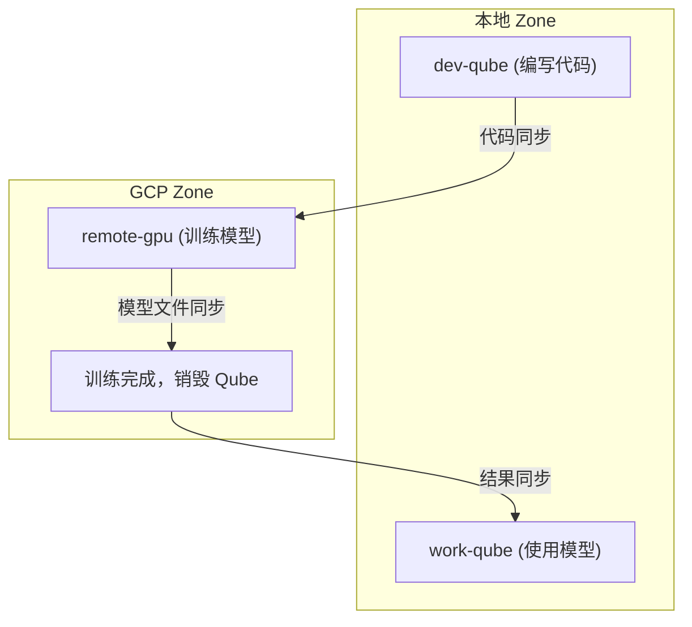

### 场景: 隔离多元化的敏感工作

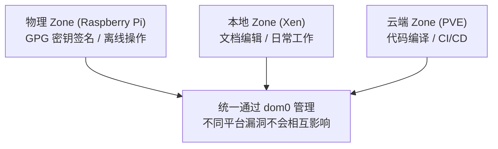

### 场景: qrexec 服务跨 Zone 调用

```bash
# 在本地 Qube 中调用远程 Zone 的 Split GPG
[user@work-qube ~]$ qubes-gpg-client --sign document.txt
# 请求透明路由到远程 Zone 的 GPG Qube

# 在远程 Qube 中调用本地 vault 的密钥
[user@remote-dev ~]$ ssh-add-qube  # 通过 qrexec 代理访问本地 vault
```

### 场景: 加密数据处理工作流

```
1. 准备加密数据上传
   [user@vault ~]$ qubes-gpg-client --encrypt sensitive-data.tar
   
2. 上传加密数据到远程 Qube
   [user@dom0 ~]$ qubes-air-ctl copy-to remote-gpu-1 sensitive-data.tar.gpg
   
3. 远程处理 (数据始终加密存储)
   [user@remote-gpu-1 ~]$ qubes-gpg-client --decrypt sensitive-data.tar.gpg
   # 解密后处理，结果重新加密
   [user@remote-gpu-1 ~]$ qubes-gpg-client --encrypt result.tar
   
4. 下载并验证
   [user@dom0 ~]$ qubes-air-ctl copy-from remote-gpu-1 result.tar.gpg
   [user@vault ~]$ qubes-gpg-client --verify result.tar.gpg.sig
```

### 场景: 使用云 HSM 保护 Zone 密钥

```
1. 在 GCP Zone 创建 HSM 保护的密钥
   [user@admin-qube ~]$ terraform apply -target=module.gcp-hsm
   
2. Zone 内 Qube 使用 HSM 密钥加密数据
   # 数据密钥由 HSM 加密，HSM 密钥永不导出
   [user@remote-gpu-1 ~]$ gcloud kms encrypt \
       --keyring=qubes-air-keyring \
       --key=zone-encryption-key \
       --plaintext-file=data-key.bin \
       --ciphertext-file=data-key.enc
   
3. 本地主密钥可以额外加密 HSM 密钥标识
   # 双重保护: 本地主密钥 + 云 HSM
```

## 路线图

> 已根据真实代码状态修订完成度。`[x]` = 已实现，`[~]` = 部分/骨架，`[ ]` = 未开始。

### Phase 0 - 修复关键问题（基本完成）

推进新功能前先修掉会误导用户或危及安全的问题：

- [x] 为 `/api/v1` 添加 **Bearer 认证**（constant-time），CORS 收敛（不再 `*` + credentials）
- [~] 加密密钥 fail-fast：长度≠32 拒绝启动；**空密钥仍回退到 dev key 并告警**（生产模式拒绝启动为待办）
- [x] 凭据多版本密钥 + **原子轮换**（`cmd/rotate-key`），补齐 `rotate-keys.sh`
- [x] README 诚实化 + 随实现进展持续更新（本次）
- [x] 监控/账单占位数据已显式标注 `placeholder`

### Phase 1 - Zone 基础架构 (MVP)

- [x] 项目架构设计 (基于官方 Qubes Air 愿景)
- [x] 管理控制台骨架（Go/Gin 后端 + Svelte 前端，CRUD + 测试 + CI）
- [x] 凭据 AES-256-GCM 加密存储
- [x] Salt States 基础框架（sys-remote WireGuard/网关/防火墙，真实可用）
- [~] Terraform modules 骨架（结构就绪，但**不创建真实资源**）
- [~] qrexec 客户端（代码实现，但**未接入 service**）
- [ ] **打通一条真实端到端链路**（建议 Proxmox：控制台 → 真实 provision → 状态回写）
- [ ] sys-remote ServiceVM 模板与 dom0 集成
- [ ] `qubes-air-ctl` 等控制脚本

### Phase 2 - 多 Zone 支持与加密

- [ ] GCP Zone 实现
- [ ] AWS Zone 实现
- [ ] Raspberry Pi 物理 Zone 实现
- [ ] Packer 镜像模板
- [ ] Zone Admin (Slave) 自动配置
- [ ] 云 HSM/KMS 集成 (AWS/GCP)
- [ ] Salt Pillar GPG 加密

### Phase 3 - qrexec 集成 / 对齐官方 RemoteVM

- [x] **调研 Qubes OS R4.3 的 RemoteVM 机制并给出对齐方案** → [docs/remotevm-alignment.md](docs/remotevm-alignment.md)（结论：拥抱官方原语，弃用自造隧道）
- [ ] 在 dom0 侧用 Salt 自动化 RemoteVM 创建 + relayvm/transport_rpc/policy（复用 qubes-salt-config 的 mgmt-jump 作 Relay）
- [ ] 把已实现的 qrexec 客户端接入 service/handler，替换掉当前的"改状态字段"占位逻辑
- [ ] vchan over TCP/IP 实现
- [ ] qrexec 代理服务
- [ ] 跨 Zone 服务调用 (Split GPG、文件传输等)
- [ ] Qubes Apps 兼容性测试

### Phase 4 - 管理控制台

- [ ] Go 后端 API 开发 (Go 1.22+)
- [ ] Svelte/SolidJS 轻量级前端
- [ ] Terraform/Salt 集成层
- [ ] Zone/Qube 管理界面
- [ ] 认证与权限管理
- [ ] 前端无动画/低资源模式

### Phase 5 - GUI 与深度集成

- [ ] Slave GUI Qube 实现
- [ ] RDP/VNC GUI 聚合
- [ ] Qubes Manager Zone 视图
- [ ] 远程一次性 Qube (DispVM) 支持

### Phase 6 - 高级特性

- [ ] 多用户/多租户支持
- [ ] 成本监控与优化建议
- [ ] 隔离多元化策略自动化
- [ ] Whonix 远程 Zone

## 与官方 Qubes Air 的关系

本项目是社区对官方 Qubes Air 愿景的实现尝试（详见上文[官方最新动态](#官方-qubes-air-最新动态2018--2025)）：

- 官方在 **Summit 2025** 上落地了 **RemoteVM** PoC（基于 qrexec 委派），并把 Qubes Air 重新定位为服务器/云端的硬件+固件地基；但官方明确表示 **Qubes Air 仍无开发排期**，主线开发已占满带宽——这正是社区实现的价值所在。
- 本项目关注实用性，优先打通核心链路而非追求完整愿景。
- **对齐方向**：本项目自造的 `sys-remote + WireGuard + 自定义 qrexec 服务` 应尽快与官方 **RemoteVM / qrexec-over-network** 原语对齐（见路线图 Phase 3），避免走向不可复用的私有协议。

## 参考资料

**官方愿景与最新动态：**
- [Qubes Air: Generalizing the Qubes Architecture](https://blog.invisiblethings.org/2018/01/22/qubes-air.html) - 2018 官方愿景文章
- [Qubes OS Summit 2025（柏林）总结](https://blog.3mdeb.com/2025/2025-10-20-qubes-os-summit-2025-berlin/) - **RemoteVM PoC、服务器/固件地基**
- [Qubes Air: Hardware, Firmware, and Architectural Foundations](https://cfp.3mdeb.com/qubes-os-summit-2025/talk/XAWYSA/) - Summit 2025 talk
- [Qubes OS 4.3.0 发布公告](https://www.qubes-os.org/news/2025/12/21/qubes-os-4-3-0-has-been-released/) - 2025-12
- [论坛：Updates on Qubes Air?](https://forum.qubes-os.org/t/updates-on-qubes-air/19709) - 官方"无排期"表态
- [Qubes Air 迁移讨论](https://forum.qubes-os.org/t/qubes-air-will-not-support-online-offline-migration-true-meaning-of-it-plans/29314) - 社区讨论

**技术文档：**
- [Qubes OS Salt 文档](https://www.qubes-os.org/doc/salt/)
- [Qubes Admin API](https://www.qubes-os.org/doc/admin-api/)
- [Qubes Core Stack](https://www.qubes-os.org/news/2017/10/03/core3/)
- [Terraform 官方文档](https://developer.hashicorp.com/terraform/docs)
- [SaltStack 官方文档](https://docs.saltproject.io/)

## 相关项目

- [Qubes OS](https://www.qubes-os.org/) - 基于安全隔离的操作系统
- [qubes-core-admin](https://github.com/QubesOS/qubes-core-admin) - Qubes Admin API 实现
- [split-ssh](https://www.qubes-os.org/doc/split-ssh/) - SSH 密钥隔离方案

## 许可证

MIT License
